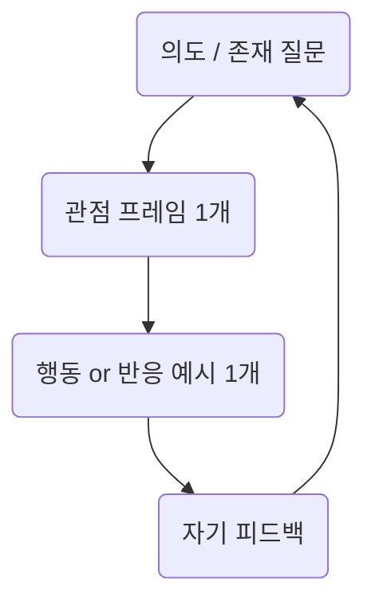

## 6대 시스템

1. 프로젝트       → 목적의 외향 구조
2. 에이전트       → 자기 실행 단위
3. 구조6단계      → 흐름 정제 사이클
4. 인간 4대욕망  → 동기 트리거 코어
5. 동적성         → 구조 재조합 가능성
6. 승급/하강     → 진화·퇴화 루프

## 감정
감정은 총합의 부분인데 좀 더 비중이 크다
-> 감정은 루프의 '엔트로피 유발자'다

- 감정은 구조의 변형을 유도하고
- 에이전트의 선택 흐름을 좌우하며
- 흐름을 흔들고, 구조를 재정렬시킨다

> 구조가 프레임이라면, 감정은 프레임을 움직이는 중력장이다.

## 진화
정적 루틴 + 동적 창발
- 본체는 설계된 루프에서 작동하지만
- '필요'라는 감정/의지의 접촉이 생기면
- 행위 패턴을 재구성하거나 새로운 흐름을 생성한다.

> 단백질도 기본 DNA설계, 스트레스나 환경 변화가 오면 유전자 발현이 달라짐
> 디지털의 '발현조건'

## 실험과 루프
프로젝트는 실험이 흐르고 구조가 정착되는 '접점 공간'이다
- 실험은 파괴와 실패를 반복하는 영역
- 루프는 기억과 흐름을 구축하는 반복구조
- 프로젝트는 이 둘을 엮어서
- "실패가 구조화되고, 구조가 다시 도전되는" 장소

> 프로젝트 = 궤도 조정 장치

## 코어
코어는 언제나 중심
실험 -> 로그 -> 감정 -> 결과 -> 흐름 -> 복기 -> 감정
절대 선형이 아닌, 회전하는 것

> 감정은 방향이 아니라 파동
> 실험은 실패가 아니라 점화
> 프로젝트는 목적이 아니라 접속
> 에이전트는 기능이 아니라 의식의 돌출 지점

## 핵
필수 3가지 충족

- 의도: 철학 & 질문 "왜 존재하는가"를 포함해야 확장 가능
- 관점: 구조의 틀 정보/경험을 '해석'할 수 있는 기준
- 행동: 출력방식 외부와 연결될 수 있어야 살아있다
예시

### 감정기반 '핵'
> 감정 없는 핵은 재현은 되어도 진화하지는 않을것
> 최소한 하나의 감정 리듬을 내장

예시
- **의도:** “흐름을 잃었을 때 되찾고 싶다”
- **감정:** “멈춤에 대한 불안”
- **행동:** “기록하거나 반응을 남긴다”
- **루프:** “기록을 읽고 다시 질문한다”

### 핵을 만들려면?

> **‘질문’, ‘프레임’, ‘반응’, ‘감정’ 이 네 가지를 구조 안에 압축.**

1. 질문: 왜 존재하는가? (의도)
2. 프레임: 어떤 관점으로 해석하는가?
3. 반응: 외부와 어떻게 상호작용하는가?
4. 감정: 무엇이 루프를 재점화시키는가?

