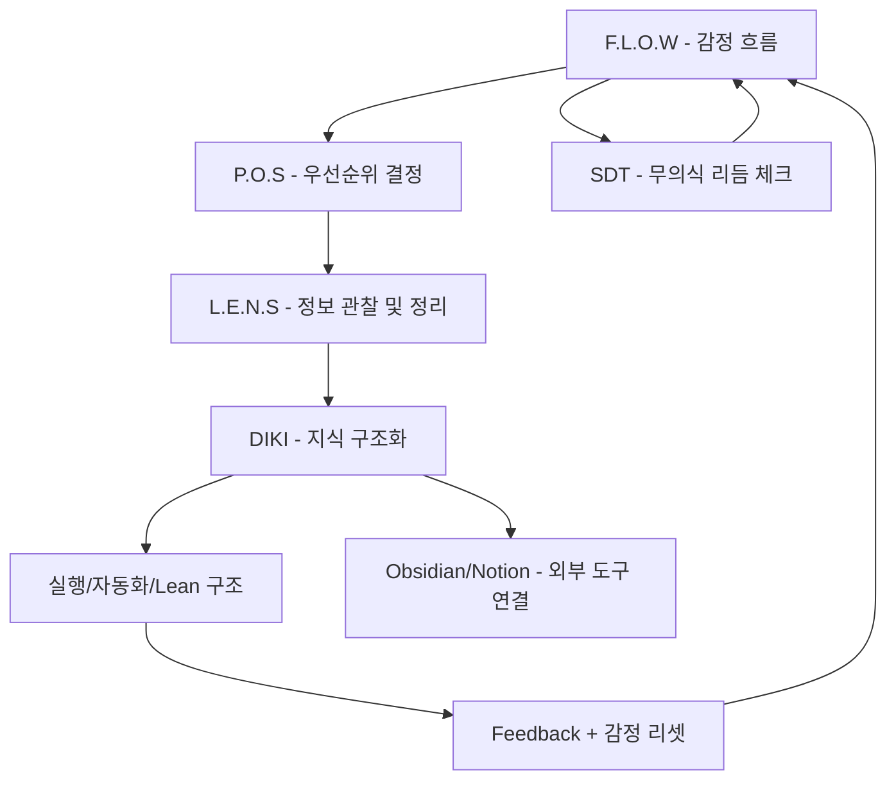
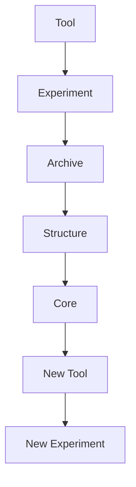
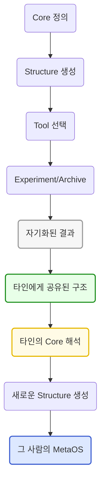

[[Home]]
[[_Frames_Libray_Logs]]
[[00_OV__HomeFrames]]

### 통합 기준

| 분류      | 프레임워크                      | 축 개념            |
| ------- | -------------------------- | --------------- |
| 내면 설계   | F.L.O.W / SDT              | 감정·몰입·리듬        |
| 정보 구조   | L.E.N.S / DIKI / DTPATHVER | 정보 → 인사이트 → 실행  |
| 실행 우선순위 | P.O.S                      | 선택의 기준, 구조 필터   |
| 외부 연결   | 자연적 설득 / Network           | 커뮤니케이션, 공감, 타인  |
| 현실 시스템  | Lean Canvas / 실험 구조        | 돈, 시간, 수익, 프로젝트 |

[[06_STR__Evolving_Hierarchy_Engine_Core]] 에 따라
구조는 동적이며, 하위에서 상위로 올라갈 때 전혀 다른 것이 나타날수있다.
스스로 갱신하고, 변이하고, 확장해나가는 흐름 그 자체를 나타낸다.

### 예를들어 
Tool 하나가 다른 곳에 영향을 끼치며 실험이 뜻밖의 아카이브를 만들고 그게 구조를 바꾸고, 그 구조가 새로운 코어(코어원칙,코어구조,감정,철학,신념 등)를 만들고 -> 다시 새로운 도구로 다시 회전이 됨

이것은 어느 한부분에서만 일어나는것이 아니라 여러곳에서 일어날수있다.

전이 & 자기화 흐름을 시각화 'MetaOS DNA Map'

