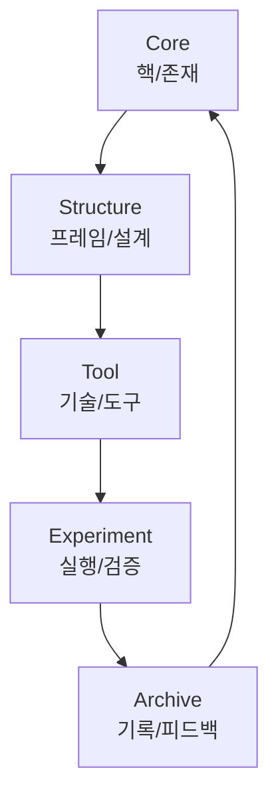

## MetaOS 구조 정의

MetaOS는 단순한 툴 모음이 아닌, **자기 진화형 지식 구조 시스템**이다.  
그 중심에는 다음 5단계 구조가 있다: **Core → Structure → Tool → Experiment → Archive**

---

## 1. Core - 존재 중심

MetaOS의 출발점.  
모든 설계는 이 질문에서 시작된다
또한 Core도 언제든지 동적으로 변화하게된다.

> "나는 왜 이것을 만들었는가?"

**핵심 요소:**
- 존재 명제 (Existence Statement)
- 키워드 정의 (e.g. 자유, 흐름, 몰입, 설계)
- 전체 구조의 목적과 방향성
- Core 선언문 (`00_Core_Manifesto.md`)

---

## 2. Structure - 구조적 설계 원리

모든 요소는 구조 없이 작동하지 않는다. Structure는 ‘어떻게’ 작동할지를 정의하는 프레임이다.  
Core를 구현하기 위한 각종 **프레임**이 이곳에 담긴다.

**핵심 요소:**
- 프레임워크 모음 (e.g. DIKI, FLOW, POS, LENS)
- 폴더 구조 설계 방식
- 상호작용 방식 (링크, 태그, 백링크)
- 디폴트 경로 및 루틴 템플릿

---

## 3. Tool - 작동 가능한 수단들

Structure를 현실화하기 위한 도구들의 집합이다.  
기술, 앱, 에디터, 자동화 루틴 등이 여기에 포함된다.

**핵심 요소:**
- Obsidian 플러그인, Make 자동화, NotebookLM
- 명령어 체계 (예: `나.`, `너.`, `~`, `#`, `*`, `!`)
- Toolset 구성 가이드
- 외부 도구 연동 구조

---

## 4. Experiment - 실험과 검증 루프

시스템은 정적인 것이 아니라 끊임없는 실험을 통해 진화해야 한다.  
Experiment는 Tool을 통해 Structure를 실제로 구현하며, Core에 피드백을 준다.

**핵심 요소:**
- 실험 기록 템플릿
- A/B 테스트, 콘텐츠 실험, 자동화 시나리오 등
- 성공/실패 조건 및 피드백 저장 방식
- 실험 → 구조 수정 루프

---

## 5. Archive - 보관과 회고

모든 결과는 기록되어야 한다.  
아카이브는 단순 보관이 아니라, 새로운 구조를 생성하는 '재료'가 된다.

**핵심 요소:**
- 실험 결과 저장소
- 실행 루틴 및 학습 데이터
- 요약본, 회고, 실행 리뷰
- 구조 재생성 알고리즘의 씨앗

---

## 🧬 구조 플로우 요약

---

## ✍️ 확장 고려 요소

- 각 단계별 `.md` 혹은 `.mdx` 템플릿 제공 예정
- 향후 SaaS 버전에서 UI Component로 전환 가능
- 최상위 프로젝트에서 프로젝트를 만들어주는 재료

