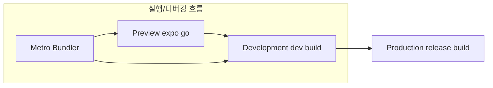

## TestIds
testIds상수를 제공하여, 실제 광고 단위 대신 테스트용 광고를 불러오도록 도와줍니다.

- 개발자 정책 준수: 테스트 중 실제 광고를 불러오면 광고 클릭에 따른 문제나 부정 클릭에 따른 문제나 부정 클릭으로 인해 광고주나 Google의 정책 위반 확률
- 안정적인 테스트 환경: TestIds는 Google에서 제공하는 테스트 전용 광고단위, 개발 환경에서 광고가 제대로 표시되는지 확인할 수 있는 안전한 방법을 제공

## 광고 정책
스플래시 화면이 나오고 메인이 잠깐 나온뒤 광고노출되면 정책위반
스플래시 화면에서 광고를 로드하고, 광고 로드가 끝난 뒤 전면광고 노출 후 전면 광고가 닫히는 트리거에 메인으로 넘기는 방법이 있죠. 

그리고 광고 노출이 100% 되는건 아니기에 실패 경우에도 메인으로 이동시키면 좋구

추가로 광고 로드가 너무 길어질때도 스플래시 화면에서 카운트를 센 뒤 그 안에 광고 노출이 되지 않는다면 광고 로드를 중단하고 메인으로 이동 시키는것도 추가하면 좋습니다.

## 개발자 / 개인 사업자
인앱 결제나 구독 모델 사용시 개인 사업자 등록이 맞으며, 여러 개발자 계정을 운영하실경우 구글과 애플의 정책으로 각 계정마다 별도의 사업자 등록이 필요하다.

## 워크플로우

### 3단계
Preview: expo start + expo go 앱으로 빠르게 미리보기 파일형태는 번들만 metro를 통해 JS로딩
Development: EAS Dev 빌드 -> 디바이스에 .apk설치 파일형태는 .apk Dev Client + Metro 연결
Production: 릴리스용 빌드 파일형태는 .aab Metro 사용안함 (JS번들을 내장함)

### 헷갈릴수있는점
모노레포를 사용하면서 루트에서 실행시키는건지 헷살릴수있다
결론은 **앱 프로젝트 루트**에서 실행하는게 기본이다.

expo start: 실행 위치 `apps/gugutravel` metro번들 서버 실행 (app.config.js)기준으로 찾는다.
eas build: 실행 위치 `apps/gugutravel` 해당 앱의 eas.json, android/, env기준
npm install, pnpm i 실행 위치 `루트` 모든 workspace에 대해 의존성 설치한다.
expo prebuild 실행 위치 `apps/gugutravel` 해당 앱의 android/, ios/ 생성
abd install, gradlew 실행 위치 `apps/gugutravel/android` 이건 네이티브 빌드 전용

버전관리 실행 위치 `루트`
공통 패키지 실행 위치 `루트`
모듈 설치(pnpm install) 실행 위치 `apps/gugutravel` or `루트`

> 모노레포에서 각 개별앱은 각자만의 우주이다.
> expo start나 eas build는 반드시 앱 폴더 안에서 실행해야 설정과 경로가 정확히 잡힌다.

WSL(Ubuntu)에서 빌드 작업, Windows에서 expo start 실행을 병행
모노레포 + Dev Client 환경에서 아주 유효한 구조다.

eas build , expo prebuild, gradlew -> 빌드 및 서명 작업 (Ubuntu-WSL)
expo start, UI개발,JS코드 수정 -> Metro 실행 및 Dev Client 연결 (Window)
! 추가로 pnpm 워크스페이스면 앱 프로젝트에 pnpm exec expo start 처럼 사용한다.
! 추가로 --dev client를 설정을 넣고 그전에 eas build를 거쳐야된다. 또한 --profile preview는 Expo Go에서 테스트 가능하도록 빌드되기때문에 development나 production로 가야한다.

클라우드와 로컬빌드의 차이점?
클라우드 빌드는 환경 일관성이 존재, 항상 클린 빌드, PR 마다 자동 빌드 가능(깃허브 연동), 자동 관리 + 암호화 저장, 코드 서명 포함 최적 빌드, Windows에서도 ios빌드 가능, 웹이서 기록/공유 가능

다작이거나 혼자개발하거나 Ubuntu WSL  환경을 이미 잘 구성했거나 현재 ios빌드는 필요없고 빌드 결과물을 직접 컨트롤하고자 하여서 로컬빌드를 사용한다.

### 프리뷰 빌드 사전 검증 루틴 설계
명시적으로 스크립트 검사 : 커맨드 실행 전 명령을 CI혹은 로컬 prebuild 단계에 강제로 삽입한다.
```bash
pnpm dlx expo doctor
pnpm dlx expo config --type public --json
pnpm dlx expo install
pnpm dlx tsc --noEmit   # 타입스크립트 에러 사전 체크
pnpm lint
```

### .apk Android Studio 내장
1. 패키지 구조, 메타데이터 확인 : android stuido More Actions 에서 debug apk항목선택 여기서 리소스 누락및 manifest 설정 확인 등 가능하다.
2. 디바이스/ 에뮬레이터에 설치: (bash)adb devices로 연결된 기기 확인 후 adb install app-release.apk(빌드된 .apk 이름)

### STEP 3. 디바이스/에뮬레이터에 설치

#### A. 실기기 연결 시:

`adb devices     # 연결된 기기 확인 adb install app-release.apk`

#### B. 에뮬레이터 설정 (Android Studio)

1. **Device Manager > Create Device**
2. API 30 이상 선택 → 실행
3. 실행된 상태에서 `adb install app-release.apk` 실행
4. [https://developer.android.com/studio/releases/platform-tools](https://developer.android.com/studio/releases/platform-tools)해당 platform-tools필요

### STEP4 실시간 로그 확인(디버깅)
 A.Logcat(Android Studio)
 View > Tool Windews > Logcat 
 태그: ReactNative, expo, RN 등 필터링
 B. CLI로그 확인
```bash
 adb logcat *:S ReactNative:V ReactNativeJS:V Expo:V
```