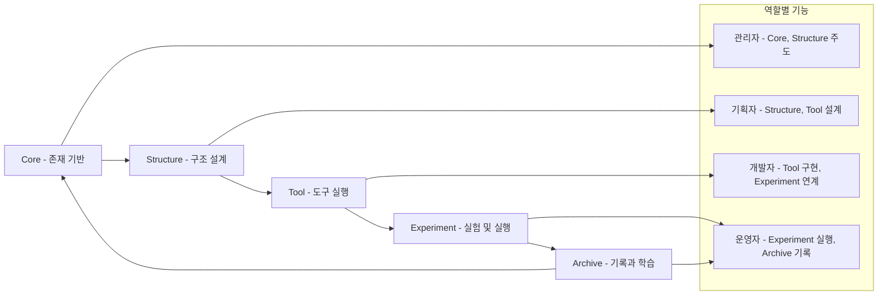

# 03. 사용 흐름 및 역할별 기능

MetaOS는 하나의 구조적 기반 위에 다양한 역할과 기능이 배치되어 있습니다. 아래는 전체 흐름을 시각화한 다이어그램입니다.

## 전체 사용 흐름

1. **Core 정의 (관리자)**: 방향성 및 존재 기반 설정
2. **Structure 설계 (기획자)**: 구조 및 워크플로우 정의
3. **Tool 실행 (개발자)**: 기능 구현 및 실행 도구 개발
4. **Experiment 적용 (운영자)**: 실제 시나리오에서 실험 진행
5. **Archive 저장 (운영자)**: 결과 기록 및 개선 루프 피드백

## 역할별 책임과 기능

### 관리자
- MetaOS의 철학, 핵심 정의 관리
- Core와 Structure 초기 설계
- 사용자 흐름 점검 및 리듬 조율

### 기획자
- 각 구조 모듈별 프레임 설계
- 역할 분배 및 흐름 정의
- Tool 요구사항 및 실행 경로 설계

### 개발자
- 실행 도구 및 시스템 구축
- 구조 흐름을 코드화
- 실험 기반 테스트 기능 개발

### 운영자
- 실험 계획 및 실행 주도
- Archive를 통해 피드백 수집
- 사용자 케이스에 따른 개선안 제시

---

> 💡 *이 구조는 고정된 것이 아닌, 사용자의 메타 철학과 실험적 흐름에 따라 유동적으로 바뀔 수 있는 창발적인 시스템입니다.*
