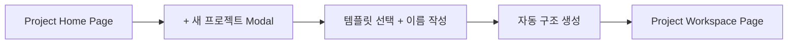

## 🎯 목표

> **사용자가 "새 프로젝트 생성 → 템플릿 선택 → 자동 구조 생성"까지  
> 매끄럽게 경험하는 UI 흐름을 설계한다.**

---

## 🧭 사용자 시나리오 (Flow Narrative)

> “처음 접속한 사용자 A는  
> MetaOS에서 ‘PLR 마켓플레이스 프로젝트’를 만들고 싶다.  
> → 홈에서 `+ 새 프로젝트` 클릭  
> → 템플릿 선택  
> → 프로젝트 이름 작성  
> → 클릭 한 번에 `00_개요 ~ 04_수익화` 구조 자동 생성  
> → 작업 시작”

---

## 🧩 UI 페이지 구조

### 🔹 1) `Project Home Page` – 모든 프로젝트 대시보드

- 좌측 사이드바: `Projects`, `Flow`, `InfoStack`, `Output`
- 메인: 카드형 프로젝트 리스트
- 상단 우측: `+ 새 프로젝트` 버튼

대시보드로 프로젝트의 대시보드 생성
프로젝트로 프로젝트 상세내용볼수있음
`

---

### 🔹 2) `New Project Modal` – 새 프로젝트 생성 모달

| 항목         | 설명                          |
| ---------- | --------------------------- |
| 프로젝트 이름    | 사용자 입력                      |
| 템플릿 선택     | 카드형 (예: PLR 마켓, 삐삐 감정 루프 등) |
| 태그 선택 (선택) | #루틴, #정보, #수익화 등            |
| 생성 버튼      | 누르면 자동 구조 생성 → 해당 프로젝트로 이동  |

→ 생성 즉시:

- `00_개요`, `01_실행 구조`, `02_자료`, `03_루틴`, `04_수익화 계획` 자동 생성
    
- 프로젝트 전용 페이지 진입
    

---

### 🔹 3) `Project Workspace Page` – 생성된 프로젝트 상세 뷰

| 섹션    | 내용                               |
| ----- | -------------------------------- |
| 상단 바  | 프로젝트명, 진행 상태, 편집                 |
| 좌측 메뉴 | 각 스텝(폴더) 보기 (00~04), 마크다운 노트, 태그 |
| 메인 뷰  | 선택된 문서 or 루틴, 실행 흐름 보여줌          |
| 우측 패널 | 백링크, 마켓 등록 상태, 메모 등 부가 정보        |

---

## 🧱 UI 컴포넌트 설계 요약

| 컴포넌트              | 설명                       |
| ----------------- | ------------------------ |
| `ProjectCard`     | 홈 화면에서 각 프로젝트 미리보기       |
| `NewProjectModal` | 새 프로젝트 생성용 팝업            |
| `TemplateCard`    | PLR/삐삐 등 템플릿 미리보기 카드     |
| `FolderBuilder`   | 템플릿 기반 폴더 자동 생성 로직       |
| `ProjectSidebar`  | 생성된 프로젝트 좌측 내비게이션        |
| `DocumentViewer`  | 선택된 구조 문서 출력 및 편집        |
| `StatusBadge`     | 각 프로젝트의 상태 표시 (준비/진행/완료) |

---

## 📌 Figma 구성 시 와이어프레임 흐름 추천

---

## 🎯 개발자를 위한 상태 흐름 예시

- 상태 관리 구조 (예: Zustand or Context API)
    
    - `projects[]` → 전체 프로젝트 목록
        
    - `currentProject` → 현재 편집 중인 프로젝트
        
    - `templates[]` → 사용 가능한 템플릿 목록
        
- 생성 후 디렉토리 구조:
    
    - `/projects/projectID/00_개요.md` 등으로 자동 생성
        

---

1. **Figma UI 디자인 시작**
1번은   
포인트 부드러운 회색톤의 배경과 카드에 그림자 효과를 주어 깊이감표현
상태 배지는 감정 루프 색상 (예:파란색은 몰입, 빨간색은 파열등)

2번은
- 템플릿 카드는 아이콘, 타이틀, 짧은 설명으로 구성
- 선택 시 외곽선 활성화 및 체크 표시 처리
- “빈 프로젝트” 템플릿은 항상 마지막 카드에 고정

3번은
- Notion과 Obsidian의 중간 스타일을 참고하여, 깔끔하고 모듈화된 인터페이스 구현
- 좌측 사이드바와 우측 보조 패널은 재사용 가능한 컴포넌트(예: Sidebar_Component, Topbar_Component, ProjectCard_Component 등)로 구성

- 프로젝트와 관련된 UI 구성요소들을 개별 컴포넌트로 분리하여 재사용 가능하게 구성
    
- 예: HomePage_UI, NewProjectModal_UI, TemplateCard_Component, ProjectWorkspace_UI 등
    
- 향후 Flow Tracker나 InfoStack 등의 확장 시 동일 컴포넌트 활용 가능

**참고 링크:**

- Figma Community에서 “dashboard”, “project management UI” 등 키워드로 다양한 무료 UI 템플릿 검색

### **1. Project Home Page**

- **구성 요소:**
    
    - **헤더바:**
        
        - MetaOS 로고
            
        - 현재 유저명
            
        - 우측 상단에 “새 프로젝트” 버튼 (Floating Button 또는 헤더 고정)
            
    - **사이드바:**
        
        - 메뉴 항목: Projects, Flow, InfoStack, Output
            
    - **메인 영역:**
        
        - 프로젝트 카드 리스트 (그리드 뷰)
            
        - 각 카드에 표시될 정보:
            
            - 프로젝트 이름
                
            - 진행률/상태 배지 (예: 🟢 진행중, 🔴 중단)
                
            - 생성일
                
            - 태그 (예: #PLR, #감정루틴)
                
- **디자인 포인트:**
    
    - 부드러운 회색톤의 배경과 카드에 그림자 효과를 주어 깊이감을 표현
        
    - 상태 배지는 감정 루프 색상 (예: 파란색은 몰입, 빨간색은 파열 등)

### **2. New Project Modal**

- **구성 요소:**
    
    - **입력창:** 사용자가 직접 프로젝트 이름 입력
        
    - **템플릿 선택 영역:**
        
        - 카드형 레이아웃, 좌우 슬라이더 또는 2열 그리드로 표시
            
        - 예시 템플릿:
            
            - 📘 PLR 마켓플레이스
                
            - 🔥 삐삐 감정루프
                
            - 🌀 빈 프로젝트
                
    - **태그 선택:** 멀티 선택 가능 (예: #루틴, #몰입루프)
        
    - **[만들기] 버튼:** 클릭 시 자동 구조 생성·해당 페이지로 이동
        
- **디자인 포인트:**
    
    - 템플릿 카드는 아이콘, 타이틀, 짧은 설명으로 구성
        
    - 선택 시 외곽선 활성화 및 체크 표시 처리
        
    - “빈 프로젝트” 템플릿은 항상 마지막 카드에 고정

### **3. Project Workspace Page**

- **레이아웃 구성:**
    
    - **좌측 사이드바:**
        
        - 프로젝트 폴더 구조 (예: 00_개요, 01_실행 구조, …)
            
        - 폴더 클릭 시 해당 문서 내용 표시
            
    - **중앙 작업 공간:**
        
        - 선택된 폴더에 따라 마크다운 뷰어 또는 에디터 제공
            
        - 폴더별 기본 안내 문구 또는 빈 템플릿 노출
            
    - **우측 보조 패널:**
        
        - 프로젝트 진행 상태(진행률)
            
        - 관련 태그
            
        - 최근 작업 항목
            
        - “마켓 등록” 상태 확인
            
        - 보조 패널은 접었다 펼 수 있도록 디자인
            
- **디자인 포인트:**
    
    - Notion과 Obsidian의 중간 스타일을 참고하여, 깔끔하고 모듈화된 인터페이스 구현
        
    - 좌측 사이드바와 우측 보조 패널은 재사용 가능한 컴포넌트(예: Sidebar_Component, Topbar_Component, ProjectCard_Component 등)로 구성