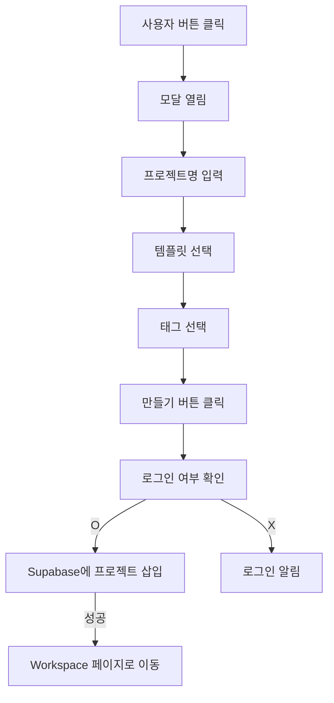

## 🧠 N.E.X.T 파인만 정리표

| 파트 이름                   | 코드 위치                                             | 한 문장 설명 (E)             | 흐름 분석 (X)                     | 내가 쓴다면 (T)                                |
| ----------------------- | ------------------------------------------------- | ----------------------- | ----------------------------- | ----------------------------------------- |
| `Dialog, DialogTrigger` | 최상단                                               | 다이얼로그 열기 구조 (모달 기반 UI)  | 버튼 클릭 → 모달 열림                 | `Sheet`나 `Drawer` 컴포넌트로 대체 가능 (모바일 대응)    |
| `useState`              | `projectName`, `selectedTemplate`, `selectedTags` | 입력 값, 선택한 템플릿, 태그 상태 관리 | 입력/선택 변화 실시간 반영               | `react-hook-form` + `watch()` 조합          |
| `TemplateCard`          | 모달 내부 컴포넌트                                        | 템플릿 정보 시각화 카드           | 선택 시 강조 처리 + onSelect         | `motion.div`로 애니메이션 추가                    |
| `toggleTag()`           | 함수 내부                                             | 태그 선택 on/off 토글 함수      | 배열에서 존재 유무로 필터링 or 추가         | `Set` 자료구조 활용하면 더 직관적                     |
| `handleCreate()`        | 버튼 onClick                                        | Supabase로 프로젝트 생성 요청    | user 확인 → 데이터 삽입 → 워크스페이스로 이동 | `try/catch` 구조화 + `toast`로 결과 알림 처리       |
| `router.push(...)`      | 생성 성공 후                                           | 프로젝트 ID로 이동 (동적 페이지 진입) | 생성된 프로젝트의 공간으로 연결             | `/project-workspace/[id]`로 리팩터하면 구조 더 깔끔함 |

---

## 🔁 전체 흐름도 (eXpand)



---

## 🔍 코드 해석 요약

```tsx
const [projectName, setProjectName] = useState("")
```

→ 사용자가 입력하는 **프로젝트 이름 상태값**. `Input`에 바인딩됨.

```tsx
const templates = [{ id: "plr", icon: "📘", ... }]
```

→ 선택 가능한 **템플릿 목록**. 시각적 카드로 렌더링됨.

```tsx
toggleTag(tag)
```

→ `selectedTags` 배열 안에 있으면 제거, 없으면 추가하는 토글 함수.

```tsx
await supabase.from("projects").insert([{ user_id, title, ... }])
```

→ Supabase `projects` 테이블에 새로운 프로젝트 row를 생성. JSON 구조 기반.

```tsx
router.push(`/project-workspace?projectId=${data.id}`)
```

→ 생성된 프로젝트 ID를 쿼리로 넘겨서 **워크스페이스 진입**.  
(라우팅 방식은 `/workspace/${id}`가 더 직관적이긴 함.)

---

## ✍️ 내가 쓴다면 (Tweak)

|항목|현재 방식|개선 포인트|
|---|---|---|
|**입력 처리**|useState로 각각 처리|`react-hook-form` + `zod`로 구조화 (버그 방지)|
|**태그 관리**|문자열 배열 토글|`Set` 자료구조로 중복 방지 + 성능 향상|
|**모달 방식**|Dialog 기반|`Drawer`, `ModalSheet` 구조로 UX 강화|
|**결과 피드백**|alert()|`toast`, `Snackbar`, `status box`|
|**라우팅**|쿼리스트링 기반 이동|`/project-workspace/[id]` 형태로 동적 라우트로 개선|
|**템플릿 로직**|UI에만 사용|템플릿 선택 시, DB 구조도 프리셋 연동 가능|

---

## ✅ 요약 한 문장

> 이 컴포넌트는 Supabase 기반으로 프로젝트를 생성하고 워크스페이스로 이동하는 **MetaOS의 생성 트리거**이며,  
> **모달 + 입력 + 템플릿 선택 + 태그 + DB 삽입 + 라우팅**이라는 모든 흐름이 한 곳에 담긴 실전형 생성기다.
