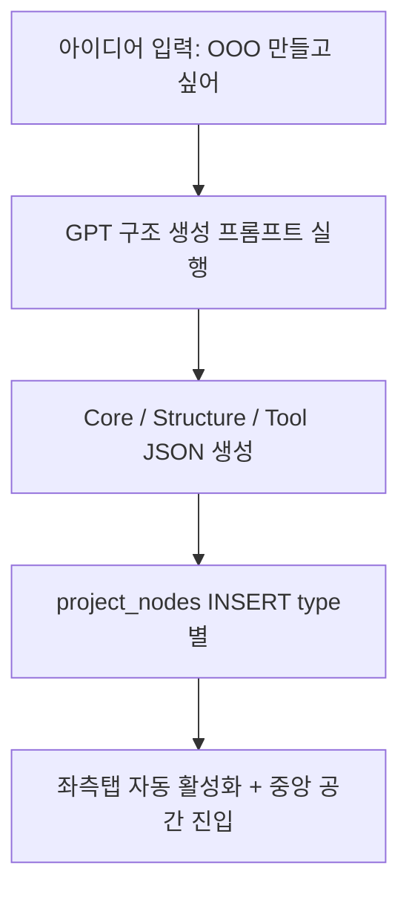

[[Home]]
[[00_Home]]

목표라면 목표

또한 다른 프로젝트 MVP시간 단축

MetaOS는 '존재의 운영체제'다.
그 안에서 자란 실험과 기능은 각각 자식 프로젝트가 될 수 있고, 중심은 항상 나의 흐름과 철학으로 돌아와야 한다.
초기 MVP는 통합형으로 빌드
확장 시엔 분리형 구조로 진화
> 항상 그 **리듬을 보존하는 중심 허브** 로 존재해야한다.

| 층   | 구조       | 설명                |
| --- | -------- | ----------------- |
| 1단계 | 프레임워크    | 실행의 도구, 정리와 정착    |
| 2단계 | 메타 프레임워크 | 구조를 감시하고 조율       |
| 3단계 | 형(形)의 철학 | 자유와 자연에 가까운 설계 철학 |

### 🔧 1단계: 구조화 (트리 기반)

- 린캔버스, LENS, POS, FLOW, A/B 등등
    
- 각각 문제 → 정보 → 실행 → 루틴 → 실험 → 출력 등 역할 있음
    

### 🔄 2단계: 조율 (메타 프레임워크)

- “지금 이 구조를 쓰는 게 맞아?”
    
- “빠졌거나 왜곡된 건 없어?”
    
- “다른 구조로 넘겨야 할 타이밍은 언제야?”
    
- “지금 나의 상태와 구조가 맞물리는가?”

**지금 할 수 있는 최소 MVP는:**

-  입력창: “무엇을 하고 싶은가요?”
    
-  → Core + Structure + Tool 자동 생성 (GPT 연동)
    
-  → project_nodes 폴더 자동 생성
    
-  → 중앙 UI에 몰입 공간 활성화
    
-  → 오른쪽 패널에서 루틴 제안

카테고리
#Productivity #ProjectManagement #OS

개인 또는 팀의 정보,작업,흐름을 정리하고 몰입 루틴과 실행력을 끌어올리는 시스템 Notion,Obsidian,Tana 같은 생산성 OS와 비슷한 사용 목적

내부 구조는 완전히 개인화 운영체제 형태
정보, 감정, 철학, 실행을 통합하는 메타 레벨 사고 도구로 설계되어 있음

AI / Agent / Automation
#Ai #Agent #Automation
감정 루틴이나 실행 흐름을 ai/agent기반'
자동화된 정보 수집, 실험 흐름 등이 에이전트와 연결됨

Analytics / Data / Developer tools
#Analytics #Data #DeveloperTools
옵시디언 연동, 노트북LM활용 등 정보 수집 -> 분석 -> 통찰 추출 흐름 내재화
향후 연구실 모듈에서 사용자 형태/패턴 분석 -> 행동 리듬 분석이 포함
분석 도구 , 개발자용 도구 기능도 흡수가능

ProjectManagement / ProductMangement
#PM
Core-Structure-Tool-Experiment-Archive 구조 자체가 메타 플로젝트 관리 시스템 다양한 프로젝트 생성, 실행,검토 , 반복 루프가 정형화되어 있음

## MetaOS
의 이름의 뜻
Meta: '위에서', 구조를 관찰하고, 초월하고, 설계하는
OS: '행동과 시스템을 자동으로 관리하는 기반 체계'
-> 생각과 행동의 흐름을 새롭게 설계하고 운영하는 체계를 꿈꾼다.

