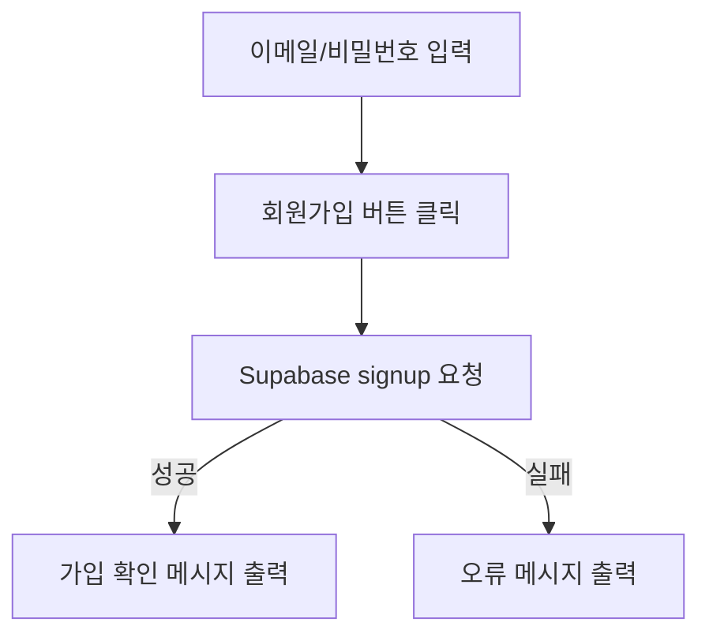

## N.E.X.T 파인만 구조 분석

| 코드 파트 이름                 | 코드 위치               | 한 문장 설명 (E)               | 흐름 해석 (X)                             | 내가 쓴다면 (T)                      |
| ------------------------ | ------------------- | ------------------------- | ------------------------------------- | ------------------------------- |
| `useState`               | 컴포넌트 상단             | 사용자 입력 값과 UI 상태를 저장       | email, password, loading, message를 추적 | `react-hook-form` + `zod`로 구조화  |
| `supabase.auth.signUp()` | `handleSignUp()` 내부 | Supabase에 회원가입 요청         | 인증 이메일이 발송되며, DB에는 `user`가 생성됨        | 회원가입 후 자동 로그인 or 대기 메시지 UI 추가   |
| `console.log(data.user)` | 성공 응답 확인            | 가입된 유저 정보 확인용 (디버깅)       | 개발 중 확인용이며, 운영 시 제거 필요                | 로그 대신 toast, 추적 ID 등 도입         |
| `setMessage(...)`        | 에러 or 성공 메시지 표시     | 사용자 피드백 전달                | 입력 오류, 서버 오류, 성공 메시지를 표시함             | `react-toastify` 등 UI 피드백 도구 활용 |
| `button[type=submit]`    | `<form>` 내부         | 회원가입 버튼                   | 입력 값 제출 트리거                           | loading 시 spinner icon 추가       |
| `<form onSubmit={...}>`  | 메인 로직 진입점           | 사용자가 제출 시 handleSignUp 호출 | 기본 이벤트 막고 Supabase 호출                 | `onBlur` + 실시간 validation도 추가   |

---

## 전체 흐름도 (eXpand 단계)



---

## 코드 해석 요약 (E)

supabase, shadin/ui{Button,Input,Card}, Link , motion사용

```tsx
const { data, error } = await supabase.auth.signUp({ email, password });
```

→ Supabase에 회원가입 요청을 보냄. 성공 시 `data.user` 반환, 실패 시 `error` 포함.

```tsx
if (!error && data?.user) {
  setMessage('회원가입 성공! 확인 이메일을 확인하세요.');
}
```

→ 가입 성공 시 안내 메시지 표시 (이메일 인증 요구됨)

```tsx
else {
  setMessage(error.message);
}
```

→ 가입 실패 (이메일 중복, 비밀번호 약함 등) 시 오류 메시지 노출


|항목|현재 방식|개선 포인트|
|---|---|---|
|폼 구조|`<input>` + `useState`|`react-hook-form + zod`로 validation 분리|
|상태 메시지|`<p style={{color: red}}>`|`toast` 또는 `Alert 컴포넌트`로 리팩터|
|비밀번호 조건|없음|최소 길이, 대문자, 특수문자 조건 추가|
|이메일 인증|메시지로 안내만|확인 이메일 재전송 버튼도 포함|
|회원가입 성공 후 행동|메시지 출력만|3초 후 `/login` 자동 이동 or 클릭 유도|

---


> 이 코드는 Supabase 기반으로 이메일/비밀번호 회원가입을 처리하는  
> **가장 기본적이고 실전적인 인증 컴포넌트**로, 상태관리와 사용자 피드백이 핵심이다.


## 디자인
&times -> x 클릭시 링크"/"이동 [[index.tsx]]
form속성 -> handleSignup