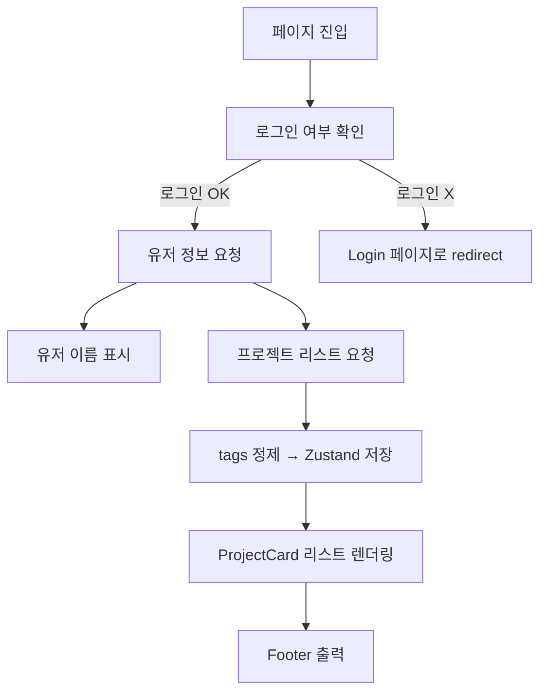

## 🔵 **전체 맥락: 이 코드는 뭐냐?**

> 로그인한 사용자의 이름과 프로젝트 리스트를 Supabase에서 불러와 상태관리하고 보여주는,  
> **"MetaOS 앱의 사용자 맞춤형 홈 대시보드 페이지"**

---

## 🧠 **N.E.X.T 파인만 방식 분석표**

|코드 파트 이름|위치|한 문장 요약|왜 존재하냐(역할)|내 방식이면?|
|---|---|---|---|---|
|`useRouter`|최상단|페이지 전환용 내비게이션|로그인 안 한 유저 리디렉션|router 대신 `next/navigation` + `redirect()`로 최신 방식 적용|
|`useAppStore`|zustand|전역 상태 관리 (유저/프로젝트 저장)|supabase → store → 컴포넌트 반영|타입 분리하고 `immer` 적용|
|`useEffect(init)`|컴포넌트 진입 시 실행|로그인 확인 + 유저 정보 + 프로젝트 불러오기|서버로부터 데이터 수신|`react-query`나 `swr`로 리팩터|
|`setUserName()`|Supabase users 테이블 조회|닉네임 표시용|환영 메시지에 쓰임|전체 프로필 불러오기 + 아바타 추가|
|`normalized projects`|tags 정제 로직|문자열로 저장된 tags → 배열화|프로젝트 카드에 태그 표시 위해|`zod`나 `superstruct`로 구조 정제|
|`<NewProjectModal />`|헤더 버튼|새 프로젝트 추가 모달 열기|유저의 주요 인터랙션 유도|이걸 floating 버튼으로 바꿔 더 강조|
|`<ProjectCard />`|각 프로젝트 표시|프로젝트 정보를 카드 형태로 출력|홈 대시보드의 핵심 구성|카드 hover 시 미리보기 지원|
|`<aside>`|좌측 사이드바|페이지 이동 메뉴 제공|대시보드 기본 구조|선택된 메뉴 강조 (active class)|
|`Footer`|페이지 하단|브랜드 및 저작권 표시|전체 앱 통일감|버전 정보, 설정, 피드백 링크 추가|

---

## 🔁 **전체 흐름 (flowchart로)**



---

## ✍️ **내가 쓴다면? (적용 기준)**

|현재 방식|내 방식|이유|
|---|---|---|
|supabase 직접 호출|`react-query`로 호출|로딩/에러/리페치 관리 깔끔|
|Zustand에 상태 수동 저장|`zustand + persist + immer`|상태 추적 & 불변성 유지|
|JSON.parse로 tag 정제|`zod` or `safeParse()`|구조 예외처리 안전|
|`useEffect`로 init() 실행|`page.tsx`에서 loader로 분리|SSR/CSR 구분 관리|

---

## 💬 코드별 해석 요약

```tsx
const {
  data: { user: authUser },
  error: userError,
} = await supabase.auth.getUser();
```

→ **현재 로그인된 유저 정보 가져옴. 없으면 로그인 페이지로 리다이렉트.**

```tsx
const { data: profile } = await supabase
  .from('users')
  .select('name')
  .eq('id', authUser.id)
  .single();
```

→ **유저의 닉네임(name)을 users 테이블에서 추출.**

```tsx
const { data: projData } = await supabase
  .from('projects')
  .select('*')
  .eq('user_id', authUser.id);
```

→ **현재 유저의 프로젝트 리스트를 DB에서 가져옴.**

```tsx
const normalized = projData.map((p) => ({
  ...p,
  tags: typeof p.tags === "string" ? JSON.parse(p.tags) : [],
}));
```

→ **tags 필드가 문자열이면 배열로 파싱.**

```tsx
<ProjectCard name={proj.title} status={proj.status} ... />
```

→ **개별 프로젝트 카드를 그리드로 출력.**

---

## 🟨 정리 요약

> **이 코드는 사용자 인증 → 유저 데이터 로드 → 프로젝트 렌더링까지 전형적인 "대시보드 진입 흐름"을 갖춘 구조로, 상태 관리(Zustand)와 Supabase DB 연동을 활용한 실전형 구조.**

