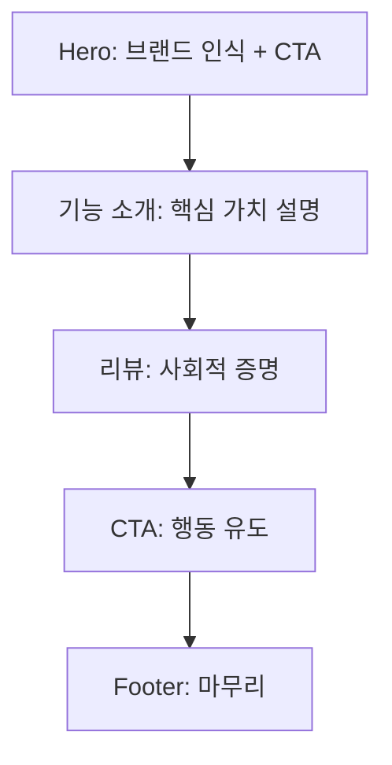

## 🔷 전체 코드는?

> **"MetaOS라는 SaaS를 소개하고, 체험 유도 및 가입을 목표로 하는 심플한 랜딩 페이지"**

---

## 📦 **N.E.X.T 파인만 구조로 해부**

| 파트 이름              | 코드 위치                                        | 한 문장 요약             | 핵심 역할 (Why)           | 내가 쓴다면                     |
| ------------------ | -------------------------------------------- | ------------------- | --------------------- | -------------------------- |
| **1. Head**        | 없음                                           | SEO 및 타이틀 설정        | 페이지 정보 명시             | `metadata.ts`로 분리해서 SEO 설계 |
| **2. Hero 섹션**     | `<section className="bg-gradient-to-r...">`  | "우리는 누구냐?" 첫 인상 강조  | 브랜드 메시지 + CTA(체험 유도)  | 메시지에 슬로건 + 비주얼 효과 추가       |
| **3. 기능 소개**       | `<section className="py-16 px-8...">`        | "우리가 뭘 해줄 수 있냐?" 설명 | 핵심 기능 3가지 (가치 전달)     | 각 기능에 아이콘 or 실제 데모 이미지 삽입  |
| **4. 고객 리뷰**       | `<section className="bg-gray-900 py-16...">` | "다른 사람도 만족했는가?" 증거  | 신뢰감 부여 (사회적 증명)       | 실제 인터뷰 영상 or 사진 + 링크       |
| **5. CTA (가입 유도)** | `<section className="py-16 text-center">`    | "지금 바로 행동하라!"       | 가입 버튼 (Conversion 목적) | 무료 체험 → 기능 제한 없는 7일 체험     |
| **6. Footer**      | `<Footer />`                                 | 정보 마무리, 브랜드 통일성     | 하단 네비, 저작권, 링크 등      | 소셜 링크 + 뉴스레터 구독 추가         |

---

## 🔁 **전체 흐름 정리 (흐름 분석)**
로그인 상태시 바로 [[dashboard.tsx]]이동


> 구조적으로 매우 잘 짜여 있음  
> Funnel 구조로 유도되고 있음 (Attention → Interest → Desire → Action)

---

## ✍️ **내가 쓴다면 이렇게 쓴다**

1. **Hero**
    
    - `motion.div`로 페이드인 효과
        
    - 메인 CTA 두 개로 나눔: "기능 둘러보기" + "바로 체험하기"
        
2. **기능 소개**
    
    - 기능마다 아이콘 + 배경 hover 효과
        
    - 데모 영상 or GIF 추가
        
    - 클릭 시 기능 상세 페이지로 이동
        
3. **리뷰**
    
    - 실제 유저 사진 + Carousel 슬라이더
        
    - "별점 시스템" 도입 + 업계 태그 예: ⭐⭐⭐⭐⭐ (마케터)
        
4. **CTA**
    
    - `bg-gradient` 강조 + 신뢰 마크 (SSL, 신한인증 등)
        
    - 한정 수량 배너 or 유효기간(마케팅 장치)
        
5. **Footer**
    
    - 브랜드 스토리 + 소셜 미디어 링크
        
    - 뉴스레터 구독 폼 (email로 리드 수집)
        

---

## ✅ 총 정리 (1문장씩 다시 정리)

1. **Hero** → "MetaOS라는 브랜드를 3초 안에 각인시키는 메인 공간"
    
2. **기능소개** → "이 SaaS가 뭘 할 수 있는지를 직관적으로 요약"
    
3. **리뷰** → "다른 사람들이 써보고 만족한 걸 보여줌"
    
4. **CTA** → "지금 당장 가입하도록 심리적 압력을 줌"
    
5. **Footer** → "브랜드 마무리와 정보 링크를 제공하는 기본 공간"
    

---

## LandingPage
GA 스크립트 사용, 기본 디자인은 tailwind사용

```jsx
<Navigation/> 
<HeroSection/> 
<WhatIsMetaOsSection/> 
<PricingSection/>
<FeaturesSection/>
<HowItWorksSection/>
<TestimoniaIsSection/>
<CTASection/>
```

[[Navigation]]
[[HeroSection]]
[[WhatIsMetaOS]]
[[PricingSection]]
[[FeaturesSection]]
[[HowItWorksSectioin]]
[[TestimonialsSection]]
[[CTA Section]]