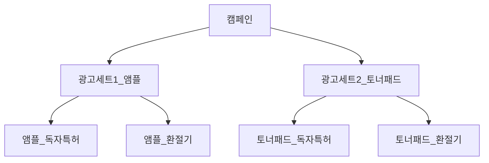

## 들어가기 전 이 노트는 무엇인가요?
비히디 프로젝트 초반부 최종 기획안 제출할때의 최종 기획안 PPT입니다.
CM팀 + PM팀 따로 가설이랑 인사이트 전략을 만들었고, PM팀에서 PPT취합과 최종 기획안부분을 맡았습니다.

CM에 팀장 1명 , PM 부팀장 1명 , 저의 역활은 최종 기획안을 만드는것이었습니다.
## 비히디 브랜드 색 가이드
글꼴: 대체적으로 noto sans KR, nanum gothic
브랜드컬러: `#9C890C `(표지,하이라이트)

### 표지배경/표지 글자: `#9C890C/#ffffff`
- 폰트: noto sans KR: 36pt, 24pt

### 목차 타이틀/중제목/본문: `#572089/#572089/#3d3d3d`
- 폰트: noto sans KR: 36pt, 20pt, 14pt

### 중제목 전환 슬라이드:  `#572089`
- (ex)01 시장 및 자사분석 중간위치
- 폰트: nanum gothic: (숫자)53pt, (제목)33pt

### 본문: `#3d3d3d`, 
- 폰트: Noto sans KR: 가급적10~14pt사이 or 8,10,12pt
- 매우중요: 볼드+밑줄
- 중요: 볼드

## 1장: 제목
구성: 제로베이스 비히디2팀 광고 기획안
- 팀원이름 적기

## 2장: 목차
구성: 
- 01: 시장 및 자사 분석
	- 시장 환경 및 역량 분석
	- SWOT분석
	- 담당 상품 분석
	- 경쟁 상품 분석
- 02: 목표 고객층 및 타겟팅
	- 페르소나
	- 타겟 및 페르소나 설정 근거
	- 핵심 메시지 도출
-  03: 가설 설정 및 전략
	- 가설설정
	- 광고 세트 구성
	- 광고 소재 구성
	- 광고 세팅 전략
	- 광고 운영 전략

## 3장: 전환슬라이드
구성: 01 시장 및 자사 분석

## 4장: 시장 환경 및 역량 분석
구성: 

시장 전망

- 2025년 국내 비건 화장품 시장 규모 약 1조 원 전망
- 연평균 14% 성장률로 지속 상승 중

시장 성장 요인

- 윤리적 소비 트렌드 확산 → 동물 실험 반대, 친환경 제품 선호 증가
- MZ세대 중심의 클린 뷰티 관심 증가 → ‘착한 소비’와 가치 소비 중시

소비자 트렌드 변화

- 소셜미디어에서 ‘비건 뷰티’ 검색량 & 언급량 증가
- 브랜드/제품 다양화 및 품질 향상 → 소비층 확대

## 5장: 시장 환경 및 역량 분석
구성:
성장

2022년 사업개시 후 당해 매출 15억, 2023년 약 20억, 2024년 40억 매출 달성

자사의 차별점

 1. 비건 & 클린 뷰티 브랜드

- 전제품에 비건 재료만 사용하며, 동물 실험을 반대하는 윤리적인 브랜드 철학
- 동물성 원료를 배제하면서도 피부에 효과적인 성분을 배합하여 건강한 피부를 추구

1. 지속 가능한 소재 사용

- FSC 인증 소재(친환경 종이)와 콩으로 만든 잉크 사용으로 환경 보호 실천
- 지속 가능성과 친환경성을 중시하는 소비자들에게 긍정적인 인식 제공

1. 피부과 인증 제품

- 실제 피부과 시술 후 사용되는 제품으로 피부 개선 효과에 대한 신뢰성 확보
- 전국 피부과 및 약국에서 판매되는 유통망으로 접근성 강화

## 6장: SWOT분석
구성: 
- S:강점
	- 국내 최초의 '비건 리버스에이징' 포지셔닝
	- 독자적인 특허 3가지 보유
	- 전문 의료기관 및 약국 입점
	- 지속가능한 업사이클링 원료 활용
- W:약점
	- 제품에 대한 핵심 키워드 부재로 브랜드 각인 
	- 부족브랜드 인지도가 다소 부족
- O:기회
	- 비건, 클린뷰티 및 리버스에이징 시장 성장
	- 높은 임상 데이터를 적극적으로 활용하여 소비자 신뢰 확보 가능
	- 해외에서 인디 K-뷰티 브랜드의 인기가 상승하여 글로벌 시장 진출 기회 가능성 큼
- T:위협
	-  **적극적이지 않은 프로모션 및 마케팅
	- 온라인 유통 플랫폼 내 마케팅 광고 비용 부담 증가**

## 7장: 담당 상품분석
구성:

|            | **플럼 앰플**                                                                                          | **플럼 토너패드**                                                                      |
| ---------- | -------------------------------------------------------------------------------------------------- | -------------------------------------------------------------------------------- |
| 기능         | 보습 + 노화 + 피부장벽 케어                                                                                  | 각질 정돈 + 모공케어                                                                     |
| 기능적 포인트    | - 민감성 피부 맞춤 저자극 포뮬라  - 피부 장벽 강화 & 탄력 개선  - 끈적임 없이 촉촉한 보습막 형성                                 | - 저자극 성분 & PH 밸런스 케어   - 피지 제거+모공케어+무자극 인증   - 민감한 피부에도 순한 속보습 & 피부 장벽 케어  |
| **제품 USP** | - 자두 유산균 발효 성분으로 피부 장벽 케어 시너지 극대화  - 고함량 자두추출물 항산화 케어로 노화 방지  - 고기능+저자극 고농축 앰플, 시술 후 케어에도 적합 | - 앰플을 머금은 고보습 저자극 패드   - 자두 추출물 베이스+고기능 모공 케어   - 전성분 EWG 그린등급 → 가장 안전한 성분 |
|            |                                                                                                    |                                                                                  |

## 8장: 경쟁상품 분석(앰플)
구성:

 **스킨푸드 유자씨 잡티 맑은 세럼**
  **특징
1. 잡티, 기미에 포커싱
2. 미백기능성 제품
3. 자극걱정을 줄인 제품
4. 유자 추출물

VS

 **비히디 플럼 앰플**
  **자사 제품의 차별점
5. 피부 노화, 눈가 주름, 색소침착 등 7종 안티에이징 성분
6. 3개의 개발 특허를 통한 제품력 인증
7. 국내 대형 피부과 입점
8. 독자적 특허 원료 자두 추출물

**9장: 경쟁상품 분석(토너패드)**
구성: 
**비건이펙트 그린 청보리 라하 토너패드**
  **특징
1. 피부결 개선
2. 피부 저자극 인증
3. 약산성 토너 패드
4. 청보리 베이스
5. 비건 인증

VS

 **비히디 플럼 토너 패드**
  **자사 제품의 차별점
1. 피부결, 모공 개선
2. 5가지 기능성 케어 인증
3. 미백/주름 이중 개선 기능성 인증
4. 자두 추출물 베이스
5. 비건 인증

* 선정기준: 올리브영 어플에서 ‘비건’ 키워드로 검색시 가장 상단에 위치한 제품

## 10장: 전환슬라이드
구성: 02 목표 고객층 및 핵심메시지

## 11장: 02 타겟분석 - 페르소나
구성: 
**니즈

환경과 윤리를 중시하는 비건 뷰티 소비자로 자연 유래 성분과 동물 실험 없는 제품을 선호하며, 주름, 모공, 건조함, 각질을 개선하는 솔루션을 찾고 있다.

페인포인트

1. 비건 제품에 관심은 많지만, 성분 표기가 불명확하거나 어떤 성분이 비건인지 명확히 알 수 없음.

2. 비건 제품의 높은 가격이 그만큼의 효과와 품질을 보장받을 수 있을지 의문.

3. 잦은 화장품 사용으로 인해 피부 장벽이 약해져 수분 손실과 자극이 심함

4. 노화로 인해 피부 탄력이 감소하고 잔주름이 생김

5. 봄철 환절기에 낮은 습도로 수분을 쉽게 빼앗기고, 외부 자극이 더해져 피부가 더욱 건조하고 예민해짐.

6. 피지 과다 분비로 인해 모공이 넓어지고, 피부가 거칠어 보임

7. 건조한 날씨나 환경으로 인해 각질이 쌓여 피부가 거칠고 칙칙해 보임.

|   |   |
|---|---|
|이름|박보라|
|성별|여성|
|나이|32살|
|직업|사무직|
|라이프스타일|비건 및 친환경 생활방식 선호,     피부건강과 안전한 성분 중요시|**

## 12장: 02 타겟 및 페르소나 설정 근거
구성: 

셀링하니의 '비히디' 키워드 분석 결과, 타겟 연령은 피부 고민에 민감한 고객층인 20~40대 여성(약 80%)으로 도출되었고

57%가 모바일 기기를 활용하여 콘텐츠 소비 및 구매 결정을 하고 있었으며. 이에 따라 비건/클린 뷰티에 관심이 높은 여성을 페르소나로 지정하였다.

* 타겟 및 페르소나 설정 근거, 출처: 셀링하니

주요타겟: 모공, 각질, 주름, 노화 등 피부에 고민이 많은 2040 여성

## 13장: 02 핵심메시지 도출
구성: 
# 비히디 제품의 차별점 (USP)

| **특징**                   | **설명** |
|---------------------------|--------------------------------|
| **100% 비건 및 윤리적 생산** | - 동물 실험을 배제하고 자연 유래 성분만을 사용   - 환경과 윤리적 소비를 중시하는 고객에게 적합 |
| **독자적 특허 원료 자두**   | - 미성숙 자두를 70일간 이중 발효하여 항산화 효능 강화   - 피부 장벽 개선 및 보습력 극대화 |
| **차별화 요소**             | - 일부 브랜드가 부분적으로 비건 제품을 제공하는 것과 차별화   - 비건 뷰티 시장에서 독창적인 기술력 확보 |
| **강화된 항산화 효과**      | - 기존 성숙 자두보다 높은 항산화 효과 제공   - 노화 방지, 모공 관리, 각질 제거, 피부 탄력 개선 등 다방면에서 뛰어난 효능 |

## 14장: 전환슬라이드
구성: 03 가설설정 및 전략
## 15장: 03 가설설정
구성: 
가설 A
가치 소비를 중시하고 친환경을 실천하려는 페르소나에게 독자 특허 성분 3가지가 워킹할 것이다.

가설 B
피부 컨디션 변화에 민감한 페르소나에게 환절기 키워드가 워킹할 것이다.

그래서(화살표 아래방향)

독자 특허 성분 3가지 vs 환절기  ``
타겟에게 어떤 키워드가 더 워킹하는지 비교 필요

## 16장: 03 기대효과
구성: 

**성과 비교**

**독자 특허 성분 3가지 VS 환절기** 

자사가 어떤 키워드로 USP를 어필해야 KPI를 만족하는 트래픽 증대를 할 수 있을지 파악하기 위해 메시지 비교를 결정

**포맷 선정**

**단일이미지**

한눈에 많은 정보를 제공하기 위해 메시지 전달과 이미지를 한번에 확인할 수 있도록 구성

**영상**

짧은 시간 안에 강한 임팩트로 소비자의 관심을 유도하여 빠르게 인식할 수 있도록 구성

## 17장: 03 광고 세트구성
구성: 

## 18장: 03 광고 소재 구성 | 광고 소재 A(앰플)
구성: 
소재

비히디 플럼 앰플 30ml

타겟

보습·탄력·노화까지 케어하는 데일리 앰플을 찾는 2040 여성

기획 의도

• 실제 사용 장면으로 제품의 제형감과 밀착력 전달

• 3가지 독자 특허 성분의 신뢰도와 차별화된 USP 강조

• 영상의 시각적 연출과 배너의 기능적 메시지를 통해 이중 후킹 유도

본문

✨하루 종일 탄력/광채 꽉 채운 피부✨

3가지 독자 특허 성분으로

윤기부터 탱탱까지

깊이 스며드는 플럼의 힘💜

-15살 어려지는 앰플, 지금 만나보세요!

`#비히디 #플럼앰플 #앰플추천 #탄력앰플

`#광채피부 #피부과화장품 #비건뷰티 #클린뷰티``

CTA 문구

플럼 앰플로 시작하는 피부 변화 [지금 구매하기]

랜딩페이지

HTTPS://BEHYDY.COM/PRODUCT/비히디-%20%20플럼-앰플-30ML/10/CATEGORY/1/%20%20DISPLAY/3/

## 19장: 03 광고 소재 구성 | 광고 소재 B(앰플)
구성: 
소재

비히디 플럼 앰플 30ml

타겟

환절기로 인한 피부 문제를 해결하고자 하는 2040여성

기획 의도

계절이 변화함에 따라 나타나는 피부 문제를 해결할 제품의 USP를 강조

일주일간 진행되는 비밀링크 할인을 통한 홈페이지 유입량 증가 목적

본문

📣환절기마다 울긋불긋한 민감성 피부 모두 주목!!

수분력 꽉 채워줄 비히디 플럼 앰플 하나면 환절기 고민 끝 거기다가 일주일간 🤫비밀링크로 들어오면 50% 할인 중🤫

지금 바로 비히디에서 만나요!

CTA 문구

지금 구매하기

랜딩페이지

https://behydy.com/surl/P/71

## 20장: 03 광고 소재 구성 | 광고 세트2 소재 A(토너패드)
소재

비히디 플럼 토너 패드 60매

타겟

늘어진 모공과 피부결 개선이 필요한 2040여성

기획 의도

비히디 특허 3종을 담은 제품의 특성과 장점을 강조

-> 사용 즉시 효과를 볼 수 있다는 점을 강조

본문

비히디 특허 3종을 듬뿍 담은 플럼 토너 패드!

늘어진 모공, 거칠어진 피부결 고민을 패드 한 장으로 쓱-싹! ✨

모공부터 피부결까지 한 번에 케어하세요!

#비히디#BEHEDY#플럼토너패드#모공#피부결#토너#패드 #토너패드#비건화장품

CTA 문구

플럼 토너 패드로 모공 플럼핑 하러 가기 > [지금 구매하기]

랜딩페이지

https://behydy.com/product/%EB%B9%84%ED%9E%88%EB%94%94-%ED%94%8C%EB%9F%BC-%ED%86%A0%EB%84%88%ED%8C%A8%EB%93%9C-60%EB%A7%A4%EC%9E%85/14/category/59/display/1/

## 21장: 03 광고 소재 구성 | 광고 세트2 소재 B(토너패드)

소재

비히디 플럼 토너 패드 60매

타겟

환절기 건조한 피부로 모공 확장을 개선하고 싶은 2040여성

기획 의도

피부가 건조해져 모공이 확장되는 봄철 환절기의 시의성을 반영

비포&애프터 형식은 모공이 확장된 상태에서 개선되는 과정을 시각적으로 강조해 제품 효과를 직관적으로 전달

이를 통해 소비자는 제품 사용 전후의 변화를 즉시 확인하고, 자연스럽게 제품 구매로 이어지도록 유도함

본문

📢 모공 부자 주목! 비히디 토너 패드 한 장으로 모공 축소 비법 대공개

요즘 모공이 늘어나서 고민이시죠? 환절기에는 피지가 증가해 모공이

확장될 수 있어요💧

걱정하지 마세요! 모공 전문가 비히디가 해결해드립니다✨

(더보기)

한 장으로 모공 면적/수/깊이/볼륨 개선

가로, 세로 다양한 모공까지 완벽하게 해결!

모공 더 커지기 전에 얼른 잡아야죠! 지금 바로 구매하세요🛒

CTA 문구

비히디 플럼 토너 패드로 모공 순삭! -> [지금 구매하기]

랜딩페이지

HTTPS://BEHYDY.COM/PRODUCT/%EB%B9%84%ED%9E%88%EB%94%94-%ED%94%8C%EB%9F%BC-%ED%86%A0%EB%84%88%ED%8C%A8%EB%93%9C-60%EB%A7%A4%EC%9E%85/14/CATEGORY/56/DISPLAY/1/

## 22장: 03 광고 세팅 전략

- 세팅 전략

|        |                                      |
| ------ | ------------------------------------ |
| 항목     | 내용                                   |
| 광고목표   | CTR 2% 이상                            |
| 총예산    | 300,000원                             |
| 집행 기간  | 3월27일 ~ 4월15일                        |
| 타겟 연령대 | 20 ~ 40대                             |
| 성별     | 여성                                   |
| 지역 설정  | 전국                                   |
| 광고 시간대 | 12:00~14:00  18:00~20:00 중심 배분 |

- 선정이유 / 기대효과

광고 목표(CTR 2% 이상): CTR를 지표로 설정하여 소재 효율성 및 최적화 진행 단기간에 고효율 광고 소재를 찾기 위함

타겟 연령대(20~40대): 비건/클린뷰티 제품에 관심이 높은 소비층

광고 시간대: 모바일 사용율이 가장 높은 점심 및 퇴근 후 시간대를 집중하여 광고효율성을 극대화

## 23장: 광고 운영 전략

- 광고 운영 전략

1차 테스트 단계

목표: 가장 효율이 높은 메시지 및 소재

진행일정: 카피 및 이미지 A/B테스트, CTR를 통해 방향성 도출 

  

2차 최적화 단계

목표: 1차 테스트 단계 결과 지표분석

진행일정: CTR이 낮은 소재 중단 또는 수정, 보완

  

3차 집중 집행 단계

목표: 최적화된 광고 집행 노출로 광고목표달성(CTR 2%)

진행일정: 1,2차 가장 효율이 좋은 소재를중심으로 예산 배분

- 예산 및 일정 / 광고세트 구성

|   |   |   |
|---|---|---|
|일정|진행 내용|예산|
|세트1  (3/27~3/31)|1차 테스트(카피+이미지 A/B 테스트)|40,000원|
|세트  (4/1~4/7)|2차 테스트(1차 CTR/CTC 분석 후 수정, 보완)|100,000원|
|세트3  (4/8~4/15)|3차 최적화된 광고 집중 집행|160,000원|

## 24장: 전환 슬라이드
구성: 감사합니다