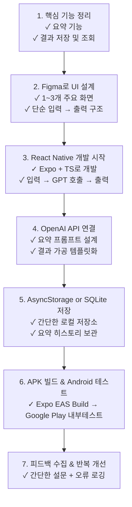
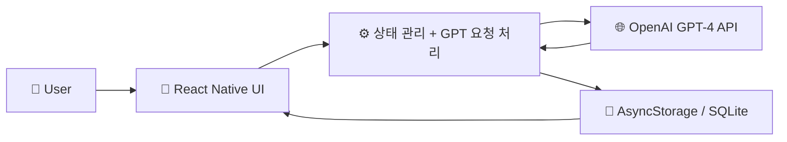

AI독서 정리앱 (옵시디언ver or 정리한노트 AI분석 창조),

## 이름
영어: Summarist(요약가/정리하는 사람)
한국어: 요약인간 (캐주얼, 콘텐츠형)

## Mini BMC: AI 독서 정리앱
| 항목          | 내용                                                                                         |
| ----------- | ------------------------------------------------------------------------------------------ |
| **고객 세그먼트** | - 독서 후 정리를 못하는 독자들- 자기계발서나 실용서 기반 실행자- 요약/지식화를 원하는 생산자형 독자- 블로거, 인스타 요약 콘텐츠 운영자            |
| **가치 제안**   | - 책 내용을 자동 요약 및 정리- 핵심 내용 인사이트화 및 정리 템플릿 제공- Obsidian/Notion 연동 지식화 시스템- 독서 메모 → 아웃풋 자동 변환 |
| **채널**      | - Notion 템플릿 마켓- 유튜브 요약 콘텐츠- 독서 인플루언서와 제휴- 앱스토어/웹사이트                                       |
| **고객 관계**   | - 맞춤형 요약 제공 (AI 커스터마이징)- 커뮤니티 내 독서 루틴 챌린지- 이메일 구독 기반 인사이트 제공                               |
| **수익 흐름**   | - 프리미엄 구독 (월간/연간)- 요약 템플릿 마켓 (PLR식)- 맞춤형 요약/리포트 제작 대행                                      |
| **핵심 활동**   | - 요약 AI 모델 훈련/튜닝- 독서 정리 템플릿 개발- 자동화 파이프라인 구축                                               |
| **핵심 자원**   | - 요약 알고리즘 (GPT + 구조화 프롬프트)- 독서 구조화 템플릿 (Obsidian 기반)- 사용자 피드백 데이터                          |
| **핵심 파트너십** | - 출판사 (요약 협약)- GPT API 제공자- 독서 모임 플랫폼 (브런치, 플라이북 등)                                        |
| **비용 구조**   | - 서버/API 요금- 모델 훈련/유지 비용- 템플릿 디자인 및 마케팅                                                    |

## MINI 린캔버스: AI 독서 정리앱
| 항목           | 내용                                                       |
| ------------ | -------------------------------------------------------- |
| **문제**       | - 책을 읽고 정리하지 못함- 요약을 해도 실행으로 연결되지 않음- 메모가 흩어져 있어 구조화 어려움 |
| **대체 솔루션**   | - 수기로 요약, 블로그/노션 기록- 유튜브 요약 영상 소비- 정리 없이 방치              |
| **솔루션**      | - 자동 요약 + 실행 정리 템플릿- 책별 요약 + 실행가이드 추출- 개인화된 독서 노트 생성     |
| **고유한 가치제안** | “읽고 끝나지 않고, 정리되어 실행되는 독서”“지식이 자산이 되는 독서 자동화 시스템”         |
| **핵심 지표**    | - 사용자당 평균 요약 수- 재방문율- 요약 → 실행 콘텐츠 전환율                    |
| **채널**       | - 독서 유튜브 채널- Obsidian/Notion 커뮤니티- 독서 앱 협업 (플라이북 등)      |
| **고객 세그먼트**  | - 자기계발서 독자- 정리/기록을 좋아하는 성향의 사람들- 퍼블리시하는 독자 (블로거, 유튜버)    |
| **비용 구조**    | - 모델 API 호출 비용- 프론트 개발 및 배포 비용- 마케팅 비용                   |
| **수익 흐름**    | - 프리미엄 구독- 템플릿 번들 판매- AI 맞춤형 요약 대행                       |



## 미니 기술 스택
| 분야             | 도구 / 기술                         | 비고            |
| -------------- | ------------------------------- | ------------- |
| **프레임워크**      | React Native (Expo)             | 빠른 MVP에 적합    |
| **언어**         | TypeScript                      | 안정성 및 확장성     |
| **UI 컴포넌트**    | React Native Paper / NativeWind | 미니멀한 UI       |
| **상태 관리**      | Zustand / Context API           | 간단한 상태 처리     |
| **요약 API**     | OpenAI GPT-4 API                | 핵심 요약 기능      |
| **저장소**        | AsyncStorage / SQLite           | 요약 히스토리 저장    |
| **파일 입력 (선택)** | Expo DocumentPicker             | 추후 확장 기능      |
| **배포 빌드**      | EAS Build (Android Only)        | APK or AAB 배포 |
| **로그 수집 (선택)** | Sentry / Expo Logging           | 오류 추적용        |


## 핵심 MVP 기능 범위
|기능|설명|
|---|---|
|**요약 입력**|텍스트 붙여넣기 방식 우선|
|**GPT 요약 호출**|간단한 프롬프트 설계|
|**출력 포맷팅**|“요약 + 인사이트 + 액션” 템플릿|
|**결과 저장/조회**|AsyncStorage로 로컬 저장|
|**UI 화면 수**|① 홈(입력), ② 결과, ③ 히스토리(선택)|
## 요약 프롬프트 예시
```text
“이 텍스트를 요약하고, 실행 가능한 행동 3가지를 제시해줘. 형식: 
1. 요약 (5줄)
2. 핵심 인사이트
3. 실행 행동 체크리스트”
```

## AI 로컬에 쓸만한 온디바이스 요약 모델(모바일 최적화 경량 모델)
| 모델명                          | 특징                         | 모바일 호환성                     | 비고                  |
| ---------------------------- | -------------------------- | --------------------------- | ------------------- |
| **DistilBART / T5-small**    | 문서 요약 전용 소형 트랜스포머          | ⚠️ 직접 사용 시 200MB 이상, 최적화 필요 | ONNX 변환 필요          |
| **MiniLM / TinyBERT**        | BERT 기반 문장 임베딩 + 키워드 추출 가능 | ✅ 상대적으로 가벼움                 | 요약보다는 문장 이해 중심      |
| **MobileBERT**               | 구글이 만든 경량 BERT             | ✅ TFLite/ONNX 호환            | 자연어 처리 전반에 적합       |
| **GPTQ 압축된 Mistral or Phi2** | LoRA or 4bit 양자화           | ⚠️ 수백MB~GB, 아직 모바일은 무거움     | Edge-device용 GPU 필요 |

## 폴더 구조
```bash
📦src
 ┣ 📂assets            # 이미지, 폰트 등 정적 리소스
 ┣ 📂components        # 공통 UI 컴포넌트 (버튼, 카드 등)
 ┣ 📂features          # 도메인 단위 기능 분리
 ┃ ┣ 📂summary         # 요약 관련 기능 (입력, 출력, 템플릿 등)
 ┃ ┣ 📂history         # 요약 히스토리 조회/저장
 ┃ ┗ 📂auth            # 로그인 기능 (선택)
 ┣ 📂hooks             # 커스텀 훅 (예: useSummary)
 ┣ 📂libs              # 외부 라이브러리 래퍼 (예: GPT API, 요약기)
 ┣ 📂screens           # 화면별 UI (홈, 결과, 히스토리 등)
 ┣ 📂navigation        # Stack, Tab Navigator 정의
 ┣ 📂services          # GPT 호출, 로컬 저장소 등 기능별 서비스
 ┣ 📂store             # Zustand or Context 상태관리
 ┣ 📂utils             # 유틸리티 함수 (문자열 처리 등)
 ┣ 📂constants         # 상수, 프롬프트, 텍스트 메시지
 ┗ 📜App.tsx           # 앱 루트 진입점

```