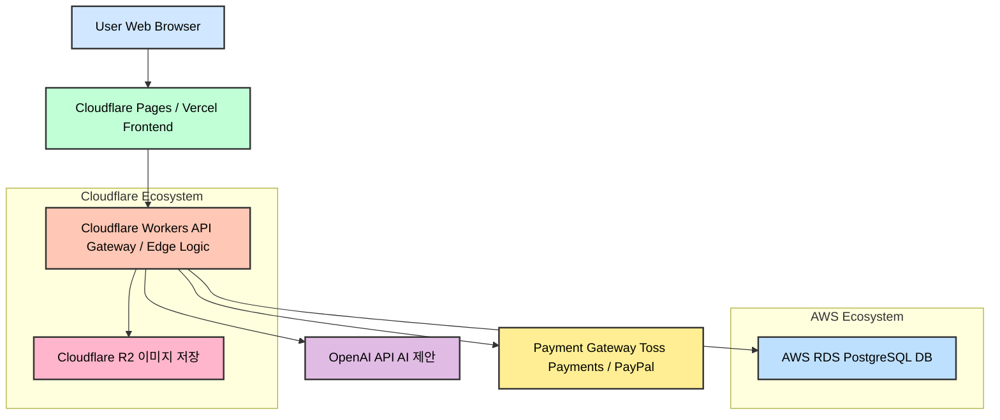

## 핵심

초기 서비스의 전체적인 기술구조를 큰 그림으로 그린다.(서버,DB, 프론트 엔드 간의 통신, AI 연동 방식등)

A. 유저 브라우저: 사용자가 뚝딱이 웹 서비스에 접속하는 환경, 웹 브라우저를 통해 뚝딱이의 프론틍엔드와 상호작용

B. Cloudflare Pages/ Vercel (Frontend - Next.js/ Remix.js) : 웹  UI를 호스팅합니다. Next.js 또는 Remix.js와 같은 프레임워크로 개발되어 정적 파일(HTML,CSS,JS)로 빌드됩니다
- CDN활용: Cloudflare Pages는 자체적으로 강력한 경우(콘텐츠 전송 네트워크)를 사용하여 전 세계 사용자에게 매우 빠르게 웹 페이지를 전달합니다.
- 서버리스 배포: 서버 관리 없이 코드를 배포하면 자동으로 최적화되어 호스팅됩니다.
통신방식: 사용자 브라우저에서 직접 Cloudflare Pages의 CDN을 통해 웹 페이지를 로드합니다. 동적인 데이터가 필요로 할때는 프론트엔드에서 Cloudflare Workers로 API요청을 보냅니다

C1. Cloudflare Workes (API Gateway / Edge Logic): 대부분의 백엔드 API 엔드포인트와 비즈니스 로직이 구현되는 곳. 사용자 인증, 목업 저장/불러오기 요청 처리, R2 및 RDS와의 통신, OpenAI API호출 등을 담당
- 특징: 엣지 컴퓨팅: 전 세계 클라우드 엣지 로케이션에 서 실행되어 사용자에게 매우 가까운 곳에서 응답
- 서버리스
- JS/TS: 프론트엔드와 동일한 언어를 사용하여 1인 개발의 효율성을 높임
- **통신 방식:**

- **프론트엔드 ↔ Workers:** HTTP(S) 기반의 RESTful API 호출.
- **Workers ↔ D1/R2/OpenAI/RDS/Payment Gateway:** 내부적으로 HTTP(S) 기반의 API 호출 또는 SDK를 통한 통신.

- **D1. OpenAI API (AI 연동 방식):**
    
    - **역할:** '뚝딱이'의 핵심 AI 기능(예: 프롬프트 기반 목업 템플릿 제안, 텍스트 기반 UI 요소 생성 등)을 담당합니다.
    - **특징:** OpenAI가 제공하는 강력한 대규모 언어 모델(LLM)이나 이미지 생성 모델을 API 호출로 활용합니다.
    - **통신 방식:** Cloudflare Workers에서 OpenAI API 엔드포인트로 HTTP(S) 요청을 보내고, 응답을 받아 프론트엔드로 전달합니다. Workers는 API 키를 안전하게 관리합니다.
- **D2. AWS RDS (PostgreSQL DB):**
    
    - **역할:** 사용자의 계정 정보, 생성된 프로젝트 및 목업의 메타데이터(목업 ID, 제목, 수정일, 구성 요소 정보 등), 구독 상태, 결제 이력 등 **관계형 데이터**를 안전하게 저장하고 관리합니다.
    - **특징:**
        - **관리형 서비스:** AWS가 DB 서버 운영, 백업, 패치, 보안 업데이트 등을 모두 담당합니다. (DBA 부담 없음)
        - **신뢰성 및 데이터 무결성:** 관계형 데이터베이스의 강점인 데이터 일관성과 무결성을 보장합니다.
        - **확장성:** 필요에 따라 DB 인스턴스 성능을 쉽게 확장할 수 있습니다.
    - **통신 방식:** Cloudflare Workers에서 AWS RDS 인스턴스로 안전한 네트워크 연결(HTTPS 또는 TCP/IP 위에 SSL/TLS 암호화)을 통해 SQL 쿼리를 실행하여 데이터를 읽고 씁니다.
- **D3. Cloudflare R2 (이미지 저장):**
    
    - **역할:** 사용자가 최종적으로 내보내기 한 목업 이미지 파일, 또는 목업 작업 중 임시로 저장되는 이미지 에셋 등을 저장합니다.
    - **특징:** 앞서 언급했듯이 **egress fees가 없어** 이미지 저장 및 전송 비용 부담이 거의 없습니다.
    - **통신 방식:** Cloudflare Workers에서 R2 스토리지에 직접 파일을 업로드하거나 다운로드합니다. 프론트엔드에서는 R2에 저장된 이미지 URL을 직접 호출하여 로드할 수 있습니다.
- **D4. Payment Gateway (Toss Payments / PayPal):**
    
    - **역할:** 사용자로부터 구독료를 결제받는 시스템입니다.
    - **특징:**
        - **한국 시장:** 토스페이먼츠를 통해 한국 신용카드, 간편결제 등을 처리합니다.
        - **글로벌 시장:** PayPal을 통해 해외 신용카드 또는 PayPal 계정 결제를 처리합니다.
        - **미래 확장:** Paddle/Lemon Squeezy와 같은 MoR 서비스는 이 결제 게이트웨이 역할과 구독 관리, 세금 처리를 통합하여 Workers와 직접 연동됩니다.
    - **통신 방식:** 프론트엔드에서 결제 모듈을 직접 호출하거나, Cloudflare Workers를 통해 결제 게이트웨이의 API를 호출하여 결제를 승인하고, 결제 성공 여부를 RDS에 기록합니다.

#### **3. 데이터 흐름 예시: 사용자 목업 생성 및 저장**

1. **사용자 (A)**: 웹 브라우저에서 '뚝딱이' 서비스(B)에 접속하여 목업을 생성합니다.
2. **프론트엔드 (B)**: 사용자의 조작(UI 요소 드래그앤드롭, 텍스트 입력 등)을 바탕으로 목업 데이터를 구성합니다.
3. **저장 요청 (B → C1):** 사용자가 '저장' 버튼을 누르면, 프론트엔드(B)는 구성된 목업 데이터(JSON 형태)와 사용자 ID를 Cloudflare Workers(C1)의 `/save-mockup` API 엔드포인트로 전송합니다.
4. **데이터베이스 저장 (C1 → D2):** Workers(C1)는 요청을 받아 목업의 메타데이터(프로젝트 ID, 목업 이름, JSON 구조 데이터 등)를 AWS RDS(D2)에 저장합니다.
5. **이미지 생성 및 저장 (C1 → D3):** Workers(C1) 또는 프론트엔드(B)에서 목업의 스냅샷 이미지를 생성하거나, 생성된 이미지를 Cloudflare R2(D3)에 업로드합니다.
6. **응답 (C1 → B):** Workers(C1)는 저장 성공 여부를 프론트엔드(B)로 응답합니다.
7. **확인 (B → A):** 프론트엔드(B)는 사용자에게 저장 성공 메시지를 표시합니다.

가장 핵심적인 최소한의 통신과 스택만 먼저 구축

--- 
검증된 시중 라이브러리 서비스
- 회원가입 (Clerk) **
- 오류 로깅(Sentry) 
- DB 상호작용 (Prisma) **
- 폼 관리 유효성 검사(React Hook Form) **
- 스키마 선언 및 유효성 검사 라이브러리 (Zod) - 리액트 훅 폼과 연동시 좋음 **
- 이메일 (Resend): 개발자 친화적 이메일 API서비스 및 이메일 디자인 **
- 분석 (Google Analytics) : 사용자 행동, 트래픽 소스 등 상세한 데이터를 수집
- 파일 업로드 관리(R2연동): @aaws-sdk/client-s3(JavaScript SDK): Cloudflare Workers에서 S3 SDK를 사용하여 사용자에게 직접 R2에 업로드할 수 있는 사전 서명된 URL(Pre-Signed URL)을 생성해 줄 수 있다. 프론트 엔드에서 R2로 파일을 직접 업로드하게 하여 서버 부하를 줄이고 속도를 높입니다.
