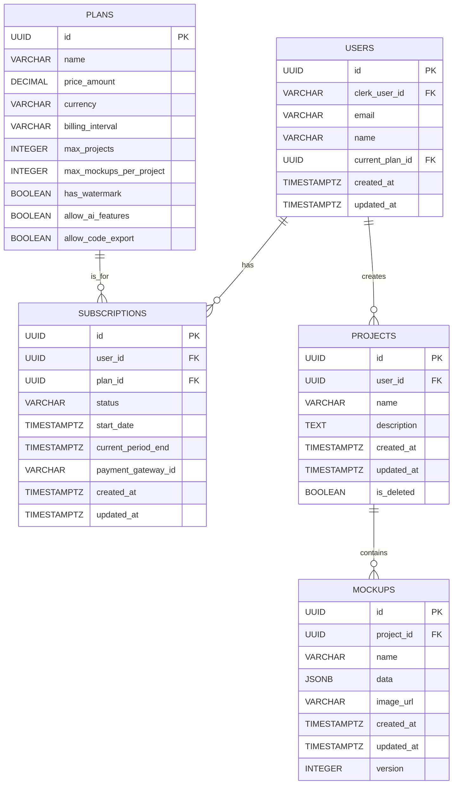

## 핵심

### 테이블 명 Users
목적: 서비스에 가입한 사용자 정보를 저장 Clerk 과 연동하므로 Clerk이 관리하는 핵심 인증 정보(비밀번호,소셜 로그인 등)외에 '뚝딱이' 서비스 운영에 필요한 추가 정보를 저장

| 컬럼명                 | 데이터타입           | 설명                                                             | 비고                                                                                                      |
| ------------------- | --------------- | -------------------------------------------------------------- | ------------------------------------------------------------------------------------------------------- |
| id                  | uuid            | clerk의 id와 동일하게 아니면 별도로 생성후 clerk_user_id와 연결                  | PK                                                                                                      |
| clerk_user_id       | `VARCHAR(255)`  | Clerk에서 제공하는 사용자 고유 ID. `뚝딱이` 사용자 계정과 Clerk 계정을 연결하는 핵심 컬럼입니다. | UNIQUE, NOT NULL                                                                                        |
| email               | `VARCHAR(255)`  | 사용자의 이메일 주소. (Clerk에서 가져옴)                                     | **UNIQUE, NOT NULL**, 로그인 시 편리한 조회를 위함                                                                  |
| name                | `VARCHAR(255)`  | 사용자의 이름 또는 닉네임. (Clerk에서 가져오거나 초기 가입 시 입력)                     | `NULL` 허용 가능                                                                                            |
| `profile_image_url` | `VARCHAR(2048)` | 프로필 이미지 URL (선택 사항)                                            | `NULL` 허용 가능                                                                                            |
| current_plan_id     | UUID            | 현재 사용자가 구독 중인 플랜의 ID. `plans` 테이블의 FK (Foreign Key).           | `NULL` 허용 (초기 가입 시에는 기본 'Free' 플랜의 ID로 초기화하거나, `null`로 두고 `subscriptions` 테이블에서만 관리할 수도 있습니다. 후자가 더 유연) |
| created_at          | TIMESTAMPTZ     | 계정 생성 일시 (타임존 정보 포함).                                          | **NOT NULL**, `DEFAULT NOW()`                                                                           |
| updated_at          | TIMESTAMPTZ     | 마지막 정보 수정 일시.                                                  | `DEFAULT NOW()`                                                                                         |
| last_login_at       | TIMESTAMPTZ     | 마지막 로그인 일시.                                                    | `NULL` 허용                                                                                               |
### 테이블 명 Plans
목적: '뚝딱이' 서비스에서 제공하는 구독 플랜의 종류와 각 플랜의 속성(가격, 기능 제한 등)을 정의

| 컬럼명                       | 데이터타입           | 설명                                                         | 비고                                         |
| ------------------------- | --------------- | ---------------------------------------------------------- | ------------------------------------------ |
| id                        | uuid            | 플랜 고유 ID.                                                  | PK                                         |
| name                      | `VARCHAR(100)`  | 플랜 이름 (예: 'Free', 'Premium Monthly', 'Premium Annually')   | **UNIQUE, NOT NULL**                       |
| description               | TEXT            | 플랜에 대한 설명                                                  | `NULL` 허용                                  |
| price_amount              | `DECIMAL(10,2)` | 플랜 가격. (예: 4900.00)                                        | **NOT NULL** (무료 플랜은 0)                    |
| `currency`                | `VARCHAR(10)`   | 통화 (예: 'KRW', 'USD')                                       | **NOT NULL**                               |
| `billing_interval`        | `VARCHAR(20)`   | 결제 주기 (예: 'month', 'year', 'lifetime', 'one_time', 'free') | **NOT NULL**                               |
| max_projects              | INTEGER         | 생성 가능한 최대 프로젝트 수 (예: Free=3, Premium=NULL(무제한))            | **`NULL` 허용                                |
| `max_mockups_per_project` | INTEGER         | 프로젝트 당 최대 목업 수 (예: Free=10, Premium=NULL(무제한))             | `NULL` 허용                                  |
| has_watermark             | BOOLEAN         | 목업 내보내기 시 워터마크 포함 여부 (True = 워터마크 있음)                      | **NOT NULL** (예: Free=True, Premium=False) |
| allow_ai_features         | BOOLEAN         | AI 기능 사용 가능 여부                                             | **NOT NULL** (예: Free=False, Premium=True) |
| allow_code_export         | BOOLEAN         | 코드 내보내기 기능 사용 가능 여부                                        | **NOT NULL** (예: Free=False, Premium=True) |
| is_active                 | BOOLEAN         | 플랜 활성화 여부 (판매 중단된 플랜 관리)                                   | **NOT NULL**, `DEFAULT TRUE`               |
| created_at                | TIMESTAMPTZ     |                                                            | **NOT NULL**, `DEFAULT NOW()`              |
| updated_at                | TIMESTAMPTZ     |                                                            | `DEFAULT NOW()`                            |

### 테이블 명 Subscriptions
목적: 각 사용자가 현재 어떤 구독 플랜을 사용하고 있는지, 구독의 시작/종료일, 결제 상태 등을 관리합니다.

| 컬럼명                    | 데이터타입          | 설명                                                               | 비고                                                         |
| ---------------------- | -------------- | ---------------------------------------------------------------- | ---------------------------------------------------------- |
| id                     | uuid           | 구독 고유 ID.                                                        | PK                                                         |
| `user_id`              | uuid           | 구독자(사용자) ID. `users` 테이블의 FK.                                    | **NOT NULL**, `FOREIGN KEY (user_id) REFERENCES users(id)` |
| `plan_id`              | uuid           | 구독 중인 플랜 ID. `plans` 테이블의 FK.                                    | **NOT NULL**, `FOREIGN KEY (plan_id) REFERENCES plans(id)` |
| status                 | `VARCHAR(50)`  | 구독 상태 (예: 'active', 'trialing', 'canceled', 'past_due', 'ended') | **NOT NULL**                                               |
| start_date             | TIMESTAMPTZ    | 구독 시작 일시.                                                        | **NOT NULL**                                               |
| ``current_period_end`` | TIMESTAMPTZ    | 현재 결제 주기가 끝나는 일시. (이후 갱신 또는 종료)                                  | **NOT NULL**, 구독 갱신 시 업데이트                                 |
| canceled_at            | TIMESTAMPTZ    | 구독 취소 요청 일시.                                                     | `NULL` 허용 (취소하지 않은 경우)                                     |
| ends_at                | TIMESTAMPTZ    | 구독이 최종적으로 종료되는 일시 (취소 후 현재 기간 끝나는 시점)                            | `NULL` 허용 (취소하지 않은 경우)                                     |
| payment_gateway_id     | `VARCHAR(255)` | 결제 시스템(Toss/Paddle 등)에서 해당 구독을 식별하는 ID.                          | `NULL` 허용 (무료 플랜이거나 직접 관리 시)                               |
| created_at             | TIMESTAMPTZ    |                                                                  | **NOT NULL**, `DEFAULT NOW()`                              |
| updated_at             | TIMESTAMPTZ    |                                                                  | `DEFAULT NOW()`                                            |

### 테이블 명 Project테이블 (사용자 작업물 - 목업의 묶음)
**목적:** 사용자가 생성한 목업들을 프로젝트 단위로 묶어 관리합니다.

| 컬럼명          | 데이터타입          | 설명                             | 비고                                                         |
| ------------ | -------------- | ------------------------------ | ---------------------------------------------------------- |
| id           | uuid           | 프로젝트 고유 ID.                    | PK                                                         |
| `user_id`    | uuid           | 프로젝트 소유자 ID. `users` 테이블의 FK.  | **NOT NULL**, `FOREIGN KEY (user_id) REFERENCES users(id)` |
| name         | `VARCHAR(255)` | 프로젝트 이름.                       | **NOT NULL**                                               |
| description  | TEXT           | 프로젝트 설명.                       | `NULL` 허용                                                  |
| `created_at` | TIMESTAMPTZ    | 구독 시작 일시.                      | **NOT NULL**, `DEFAULT NOW()`                              |
| updated_at   | TIMESTAMPTZ    | 마지막 수정 일시.                     | `DEFAULT NOW()`                                            |
| `is_deleted` | BOOLEAN        | 프로젝트 삭제 여부 (Soft Delete).      | **NOT NULL**, `DEFAULT FALSE` (삭제 시 True로 변경, 실제 데이터는 보존)  |
| `deleted_at` | TIMESTAMPTZ    | 프로젝트 삭제 일시 (Soft Delete 시 기록). | `NULL` 허용                                                  |

### 테이블 명 Mockups 테이블 (개별 목업 화면)
**목적:** 각 프로젝트 내의 개별 목업 화면 데이터를 저장

| 컬럼명          | 데이터타입           | 설명                                                   | 비고                                                               |
| ------------ | --------------- | ---------------------------------------------------- | ---------------------------------------------------------------- |
| id           | uuid            | 목업 고유 ID.                                            | PK                                                               |
| `project_id` | uuid            | 목업 소유자 ID. `projects` 테이블의 FK.                       | **NOT NULL**, `FOREIGN KEY (project_id) REFERENCES projects(id)` |
| name         | `VARCHAR(255)`  | 목업 화면 이름 (예: '로그인 페이지', '대시보드')                      | **NOT NULL**                                                     |
| data         | JSONB           | **핵심:** 목업의 구조화된 데이터 (UI 컴포넌트 정보, 위치, 속성 등 JSON 형식). | **NOT NULL** (이 데이터를 기반으로 이미지를 생성하고 편집합니다)                       |
| `image_url`  | `VARCHAR(2048)` | 생성된 목업 이미지 파일이 Cloudflare R2에 저장된 URL.               | **NOT NULL**                                                     |
| created_at   | TIMESTAMPTZ     | 목업 생성 일시.                                            | **NOT NULL**, `DEFAULT NOW()`                                    |
| `updated_at` | TIMESTAMPTZ     | 마지막 수정 일시.                                           | `DEFAULT NOW()`                                                  |
| version      | INTEGER         | 목업 변경 이력 추적을 위한 버전 번호 (선택 사항, 추후 필요 시)               | `NOT NULL`, `DEFAULT 1`                                          |
## 관계도

1. UUID 사용으로 PostgreSQL에서 UUID를 기본 키로 사용하는 것은 분산 환경과 확장성에 유리 (Prisma와도 잘 연동됨)
2. 타임스탬프는 각 테이블마다 필수로 넣고, TIMESTAMPTZ을 사용하여 시간대 문제를 방지하는 것이 좋다
3. JSONB으로 mockups.data컬럼에 JSONB를 사용하여 목업을 구성하는 요소들의 복잡한 JSON데이터를 효율적으로 저장하고 쿼리한다.
4. FK 참조 무결성을 유지하여 데이터 일관성을 높인다.
5. 인덱싱 자주 조회되는 컬럼(id(PK),user_id(FK),project_id(FK)) 인덱싱을 생성하여 쿼리 성능을 최적화
6. Soft Delete: projects 테이블에 is_deleted 컬럼을 추가한 것처럼, 실제 데이터를 지우기보다 '삭제됨' 상태로 바꾸는 soft delete구현, 실수로 인한 데이터 손실을 방지하고 나중에 복구할 수 있도록 한다.
7. (미래기능) project테이블에 shared_with_users 또는 team_id 같은 컬럼을 추가하여 협업기능 도입가능
8. 결제 이력관리 subscriptions테이블만으로 부족하다면 payments 또는 transactions테이블을 따로 만들어 상세 결제 이력을 관리 할수있다.
9. 프리즈마랑 연동이 가능하므로 schema.prisma파일을 작성할 때 이 테이블 정의를 바탕으로 하면 된다.
