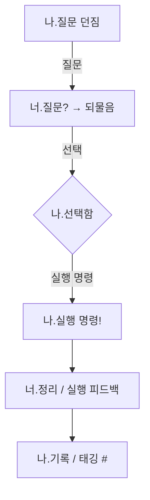

## 1. 명령어 체계 구조

MetaOS의 대화 및 실행 흐름은 **'나.'와 '너.'**로 시작하는 명령어 체계를 기반으로 작동한다. 이는 사용자(나)와 시스템 또는 Agent(너)의 행위를 구분하여 명확한 실행 흐름을 설계하기 위함이다.

### 기본 문법 구조
- `나.행동 내용`: 사용자의 실행 명령
- `너.행동 내용`: 시스템에 요청 또는 명령

### 특수 기호 의미
| 기호 | 의미             | 예시 명령어             | 설명                                 |
|------|------------------|--------------------------|--------------------------------------|
| `!`  | 즉시 실행         | `나.정리 시작!`           | 강제적/즉각적 실행을 요청              |
| `?`  | 질문 / 탐색       | `너.질문?`                | 시스템이 주도하여 사용자에게 질문함     |
| `.`  | 정지 / 관찰       | `나.흐름 멈춰.`           | 관찰하거나 잠시 멈춤                   |
| `~`  | 흐름 / 연결       | `나.노트 연결~`           | 관련 요소 또는 흐름 연결 요청           |
| `^`  | 강조 / 상승       | `너.핵심 강조^`            | 강조가 필요한 부분을 부각함            |
| `*`  | 반복 / 루프       | `나.리뷰 루틴*`            | 루틴, 반복되는 행위 설정                |
| `/`  | 분기 / 선택       | `너.실행경로/대안`         | 경로/옵션 중 선택 필요                  |
| `#`  | 메타 정보 / 태그   | `나.#실험기록`             | 문맥적 메타 태그 부여                   |

### 예시 대화 흐름
```markdown
나.정리 시작!
너.질문? 오늘 구조 중 가장 헷갈린 부분은?
나.흐름 멈춰. 우선 키워드부터 다시 볼게.
나.#FlowOS_정리 *
```

## 2. 명령어 시퀀스 구조



## 3. 용도별 활용

- **학습/사고 정리:** `나.키워드 정리~`, `너.프레임워크 요약^`
- **루틴 실행:** `나.아침 루틴*`, `너.루틴 체크!`
- **정보 분석:** `너.뉴스 요약?`, `나.주제 흐름 파악.`
- **정서 리듬:** `나.몰입 진입^`, `너.깨우기 질문?`, `나.긴장 리셋.`

## 4. 확장 계획

- MetaOS SaaS에서 명령어 입력창 UX에 그대로 활용할 수 있음
- 앞으로 명령어 체계를 기준으로 챗 인터페이스와 연동 가능한 매핑 구조 설계 예정
