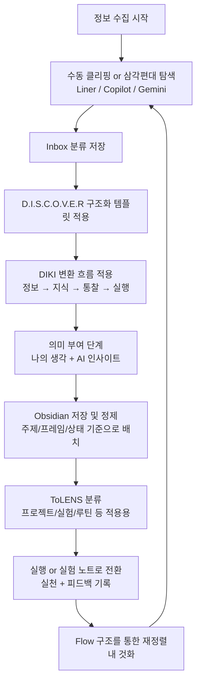

- **워크플로우**: 정보검색 가공
    
    1. **라이너 검색**:
        
        - 특정 기술, 알고리즘, 문제 해결 방법 등에 대한 신뢰성 높은 정보 검색.
            
        - 관련 자료와 데이터를 NotebookLM에 클리핑.
            
    2. **NotebookLM**:
        
        - 검색 데이터를 NotebookLM에서 정리하고, 학습 자료로 변환.
            
        - 팀 공유용 문서 초안 제작.
            
    3. **재미니(Gemini)**:
        
        - 실시간으로 정보 추가 검색 및 질문 응답.
            
        - NotebookLM에서 얻은 요약 데이터를 기반으로 특정 데이터 패턴이나 코드 논리를 확인.
            
    4. **코파일럿(Copilot)**:
        
        - 수집한 자료를 바탕으로 코드 작성 및 디버깅.
            
        - 재미니나 라이너에서 얻은 기술적 정보를 코딩 작업에 통합.
            
        - 작업 후 코드 리뷰 및 개선 아이디어 생성.
            
- **적용 사례**:
    
    - 소프트웨어 개발 프로젝트에서:
        
        - 라이너 검색으로 특정 알고리즘 논문이나 연구 자료를 분석.
            
        - NotebookLM으로 내용을 정리하고, 기술적 요구 사항을 문서화.
            
        - 재미니로 논문과 요구 사항에 대한 추가적인 의문 해결.
            
        - 코파일럿으로 코드를 작성하고, 디버깅하며 프로젝트 구현.