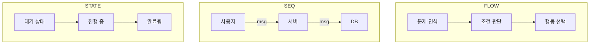

[[Home]]
[[00_OV__HomeFrames]]
[[00_CN__Mata_Core]]
# MetaFlowDSL: 통합 시각 사고언어 구조

---

## 정의

MetaFlowDSL은 플로우차트, 시퀀스 다이어그램, 상태도 등을 하나의 통합 프레임 안에서 흡수하고 표현하는 **최상위 구조 언어**이다.  
이는 D.I.S.C.O.V.E.R.의 탐색성, DIKI의 인식 구조, FLOW(=폭포수)의 감각적 전개를 바탕으로 하며,  **정보 흐름, 관계 구조, 상태 변화, 실행 전개를 하나의 시각 구조 안에서 ‘언어화’하기 위한 도구**다.

**즉, 순서를 언어화한다.**
MetaFlowDSL = 구조화 + 시각화 + 현실화 = 현실로 꺼내오기 위함
---

## 프레임 계층 위치

- 하위 프레임 포함:
  - FlowChart
  - SequenceDiagram
  - StateChart
  - ActivityDiagram
- 상위 연결 프레임:
  - [[00_STR__DIKI_Structure]] (정보→지식→통찰→실행)
  - [[04_STR__D.I.S.C.O.V.E.R_Tool]] (탐색 중심 설계)
  - [[00_STR__FLOW_Core]] (감각 기반 몰입 전개 흐름)

---

## 핵심 문법 요소

| 요소         | 설명                               |
| ---------- | -------------------------------- |
| `NODE`     | 개념/객체 단위 (예: 문제, 사용자, 시스템 등)     |
| `STATE`    | 해당 객체의 상태 변화 (예: 준비됨 → 실행 중)     |
| `FLOW`     | 단계 간 흐름/조건 분기 (예: 조건 만족 → 다음 실행) |
| `SEQ`      | 시간순 메시지 교환/상호작용 (예: 사용자→서버)      |
| `TRIGGER`  | 외부 사건에 의한 전환 발생                  |
| `LOOP`     | 반복 구조 표현 (예: 조건 반복)              |
| `DECISION` | 조건 판단 및 분기                       |

---

## 목적

- 사고 흐름을 정보 구조로 **형식화**
- 설계 로직을 시각 구조로 **통합**
- 실행 흐름을 실제 구조로 **지도화**
- 협업과 개발의 **최고 해석 프레임으로 공용화**

---

## Mermaid 통합 예제 (간략 구조)

