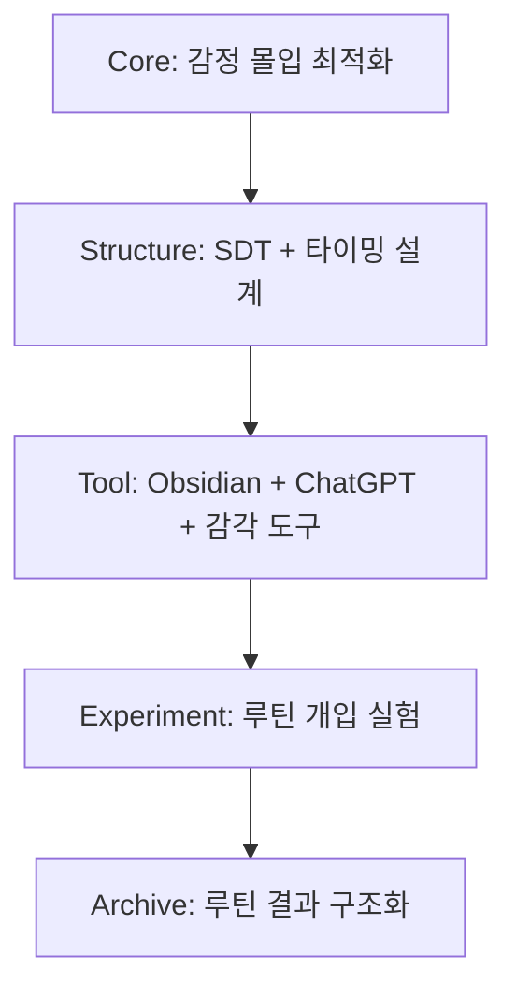

# 04. 실전 예시와 실험 사례

이 문서에서는 MetaOS의 실제 적용 사례와 실험 흐름을 통해 Core → Structure → Tool → Experiment → Archive 구조가 어떻게 현실에 반영되는지를 보여준다.

## 1. 예시 1: PLR Marketplace 수익화

### Core (존재 이유)
- 목적: 자유 + 실험 기반 창작

### Structure (루트 설계)
- `Sales_Route_Design_Framework.md` 기반 수익 흐름 설계
- Buyer Persona → 문제 정의 → 욕망 자극 → 구매 설계

### Tool
- Notion (템플릿 제작)
- Gumroad (판매)
- Make (자동화)
- (기록 및 피드백)

### Experiment
- 템플릿 A/B 테스트: 제목/가격/디자인별 클릭률 비교
- 타겟 테스트: Reddit vs Instagram 유입 비교
- 랜딩페이지 개선 실험

### Archive
- 각 실험 결과를 기록하는 장소에 시계열로 기록
- `06_Execution_Kanban.md`, `08_Metrics_Tracking.md` 반영

### 예를들어
<Mermaid>{`
flowchart TD
    CORE[Core: 경제적 자유] --> STR[Structure: 수익 루트 설계]
    STR --> TOOL[Tool: Notion/Gumroad/Make]
    TOOL --> EXP[Experiment: A/B 테스트 & 유입 테스트]
    EXP --> ARC[Archive: Obsidian 기록 & 추적]
`}</Mermaid>

---

## 2. 예시 2: 감정 루프 기반 생산성 루틴 (삐삐 프로젝트)

### Core
- 본질: 감정 기반 몰입 상태 최적화

### Structure
- SDT (Sensation - Thinking - Will) 루프 + 타이밍 기반 개입 설계

### Tool
- Obsidian (감정 기록)
- MetaOS_AIModel (삐삐 역할 수행)
- Alarmy/음악 등 감각 자극 도구
- 기계설계

### Experiment
- 기상 후 30분/1시간 후 루틴 개입 실험
- 타이밍별 정서 반응 수치화 실험 (텍스트 감정 점수화)
- 감정 언어 사용 시 몰입도 변화 측정

### Archive
- 감정 기록 시계열 분석
- 효과 높은 루틴 정리 및 구조화

---

## 3. 확장 방향

- 실험은 단순 반복이 아니라 진화 루프다.
- 성공/실패 여부보다 “기록 → 패턴 → 구조화 → 반복” 루프가 중요하다.