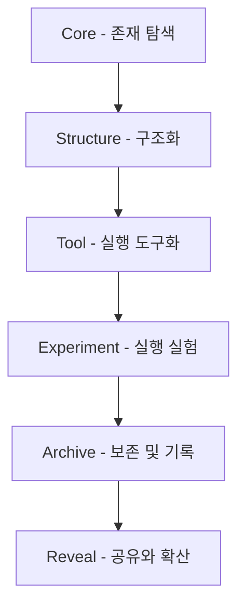

## 1. 버전 히스토리 개요

MetaOS는 단순 업데이트가 아닌 **의미 기반 진화 구조**를 따른다. 각 버전은 기능 추가가 아닌, 이해의 확장과 실행 구조의 강화라는 흐름에서 설계되었다.

## 2. 진화 개념

### 구조적 진화 6단계
| 단계 | 이름 | 설명 |
|------|------|------|
| 1단계 | Core        | 존재 중심 및 문제의식 발견 (중심)
| 2단계 | Structure   | 존재 기반 구조화 (프레임워크, 논리 계층)
| 3단계 | Tool        | 반복 가능성과 실행력 확보 (템플릿, 자동화 도구)
| 4단계 | Experiment | 실행을 통한 검증 및 감정적 연결 실험
| 5단계 | Archive     | 실행된 흐름의 보존 및 확장 가능한 형태 정리
| 6단계 | Reveal      | 외부 공유, 영향력 확대, 연결 구조로 확장

## 3. Mermaid로 보는 진화 흐름

## 4. 버전별 진화 흐름 요약

### v0.1 (초기 실험기)
- Obsidian 메모만으로 기능 구축 및 실행 실험을 통합
- 개인 내면 중심으로 구조 설계
- AI 기능 훈련

### v0.5 (내부 구조 정리기)
- 프레임워크 계층 분리 (Core/Flow/DIKI)
- 명령어 체계와 구조적 흐름 정립

### v0.8 (툴화 단계)
- SaaS 기획 및 Lab 인터페이스 설계 시작
- 실행 루틴 및 챗 구조 설계

#### 현재 기초는 v0.1 초기에 어느정도 잡은상태

### v1.0 (최초 MVP)
- MetaOS SaaS 구조화 및 실전 연결 테스트
- 명령어 구조 → 챗 인터페이스 연결
- 오픈

### v1.2~ (현재)

- 실행 흐름의 Archive 자동화 구조 확장
- Research Lab / 실험 기록 구조 정리

## 5. 향후 버전 흐름 예측

- v1.5: 감정 흐름 기반 인터페이스 도입
- v2.0: Agent 기반 완전 상호작용 구조 구축
- v3.0: 외부 사용자 대상 확장 플랫폼 설계
