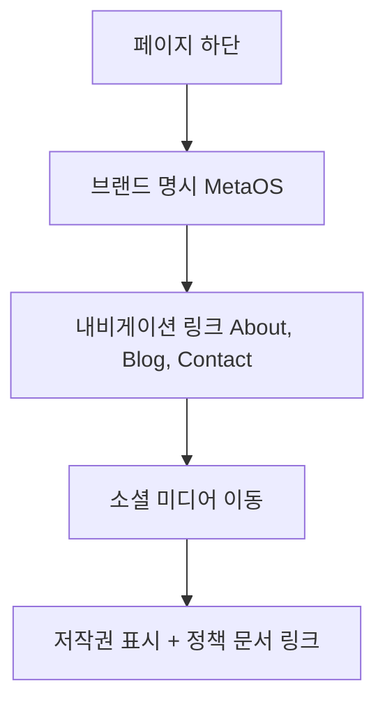

## 🧠 N.E.X.T 파인만 구조 해석

| 파트 이름            | 코드 위치                            | 한 문장 설명 (E)                 | 흐름 해석 (X)            | 내가 쓴다면 (T)                              |
| ---------------- | -------------------------------- | --------------------------- | -------------------- | --------------------------------------- |
| **"use client"** | 파일 최상단                           | 클라이언트 컴포넌트 선언 (Next.js 13+) | 상호작용은 없지만 통일성 유지     | 이 컴포넌트는 사실 서버 컴포넌트로도 가능                 |
| **로고 영역**        | `<h1>MetaOS</h1>`                | 브랜드 로고/타이틀 출력               | 브랜드 일관성 유지, 클릭 유도 가능 | `<Link href="/">MetaOS</Link>`로 홈 이동 연결 |
| **네비게이션 메뉴**     | `<nav>` 내부                       | 주요 페이지 연결용 하단 링크            | 사이트 흐름 인식 + 보조 내비게이션 | `href="#"` → 실제 경로로 연결 (404 방지)         |
| **소셜 링크**        | `<div className="mt-4 ...">`     | 트위터, 링크드인 등 외부 채널 링크        | 사용자 외부 유입 채널 제공      | 아이콘 라이브러리(FaTwitter 등)로 대체              |
| **법적 정보**        | `<div className="border-t ...">` | 저작권, 정책 링크 안내               | 법적 신뢰성 + 회사 정체성 유지   | `target="_blank"` 추가 + 실제 문서 링크 연결      |

---

## 🔁 흐름 해석 (eXpand)



---

## 🔍 코드 해석 요약

```tsx
<h1 className="text-xl font-bold">MetaOS</h1>
```

→ 브랜드 강조 텍스트. 페이지 통일성과 식별용.

```tsx
<nav className="flex space-x-6">
  <a href="#">About</a>
  ...
</nav>
```

→ 페이지 이동용 링크. 현재는 `#`로 되어 있어 비어있음 (리팩터 필요).

```tsx
<a href="#" className="text-gray-400 hover:text-white">🔵 Twitter</a>
```

→ 외부 SNS 링크. UX 측면에서 새 창 열기 추가 필요.

```tsx
<p>© 2025 MetaOS. All rights reserved.</p>
```

→ 기본적인 저작권 문구. 필수 정보.

```tsx
<a href="#">Privacy Policy</a>
```

→ 서비스의 법적 약관 링크. 신뢰 요소.

---

## ✍️ 내가 쓴다면 (Tweak)

|항목|현재|개선 포인트|
|---|---|---|
|**네비게이션 링크**|`href="#"`|실제 경로 연결 (`/about`, `/blog`, `/contact`)|
|**브랜드 클릭**|`<h1>`|`<Link href="/">MetaOS</Link>`로 홈 이동|
|**소셜 아이콘**|텍스트 이모지|`react-icons` 라이브러리로 직관성 강화|
|**정책 링크**|단순 텍스트 링크|`target="_blank"` + 실링크 연결|
|**반응형 대응**|일부 있음|`flex-wrap`, `gap` 활용, 모바일 최적화 더 강화|

---

## ✅ 요약 한 줄 정리

> 이 Footer는 브랜드, 네비게이션, 소셜 미디어, 법적 고지까지 포괄하는  
> **웹사이트의 말미 신뢰 구간 + 사용자 흐름 종료 지점**이며,  
> **브랜드 정체성 + 접근성 + 외부 확장을 동시에 책임지는 핵심 컴포넌트**다.
