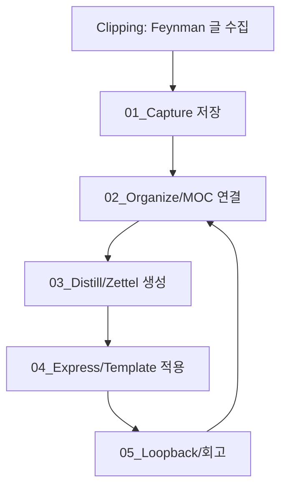

# Example.

글 하나 (오프라인 노트 사용가능)
↓
Capture/Raw.md에 수집됨 (#raw)
↓
Organize/MOC.md에 연결
↓
Distill/Zettel에 요약문 생성
↓
Express/콘텐츠 기획 or 수익 루틴으로 전환
↓
Loopback에서 회고 + 다음 실행 구조 개선

```mermaid
graph TD
A[Clipping: Feynman 글 수집] --> B[01_Capture 저장]
B --> C[02_Organize/MOC 연결]
C --> D[03_Distill/Zettel 생성]
D --> E[04_Express/Template 적용]
E --> F[05_Loopback/회고]
F --> C
```

