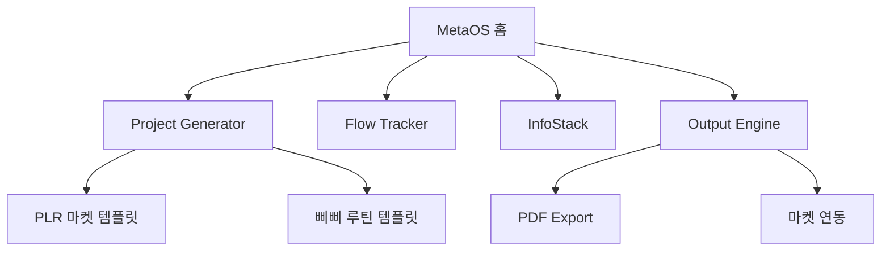

## 🧩 MetaOS Micro SaaS – MVP 핵심 정의

> **“사용자가 자신의 실행 프로젝트를 생성하고,  
> 루틴을 설정하며, 정보를 쌓고, 수익 루프를 설계할 수 있게 한다.”**

---

## 🛠️ MVP 핵심 구성 4대 모듈

### 1. 🔧 **[Project Generator] – 하위 프로젝트 생성기능 (Core)**

- 템플릿 기반 or 자유 생성 선택
    
- 기본 구조 자동 포함: `00_개요`, `01_실행 구조`, `02_자료 수집`, `03_버전 관리`, `04_수익화 계획`
    
- MetaOS 내에서 다중 프로젝트 생성 → 실행 → 완료 가능
    

**예시 기능**

- `+ 새 프로젝트 만들기`
    
- 프로젝트 템플릿 선택 (PLR 마켓 / 감정 루틴 / 연구 실험 등)
    

---

### 2. 🌀 **[Flow Tracker] – 실행 루틴 트래커 (Action Loop)**

- 매일/주간 루틴 설정
    
- 진행률 시각화 (ex. Kanban, Timeline)
    
- 감정 루틴 포함 가능 (삐삐 연결)
    

**예시 기능**

- 실행 카운터, 체크리스트
    
- “파열루틴 발동” 같은 감정 트리거 등록
    
- 오늘의 루틴 → 자동 리듬 감지 후 피드백
    

---

### 3. 📚 **[InfoStack] – 정보 입력/정리 구조 (Knowledge Base)**

- 사용자 정의 태그/노트 구조
    
- 실행 중 쌓이는 자료 정리
    
- 내부 Obsidian 호환 or 내장형 노트 시스템
    

**예시 기능**

- Notion/Obsidian 구조처럼 폴더/카드 형식 지원
    
- 태그 기반 연결 (ex. #루틴 #수익화 #리듬 등)
    
- 연결된 노트끼리 백링크/흐름 시각화
    

---

### 4. 💰 **[Output Engine] – 수익화/템플릿화 구조 (Product Loop)**

- 프로젝트를 마켓에 올릴 수 있는 구조 포함
    
- 템플릿화 가능 → 판매 등록 가능 (ex. PLR 마켓)
    
- 유저가 만든 시스템 자체를 상품화
    

**예시 기능**

- ‘이 프로젝트를 마켓에 공유하기’ 버튼
    
- 자동 PDF 변환 or 템플릿 파일 생성
    
- Gumroad, Shopify, Notion 연동 API
    

---

## 🧠 보너스: 철학 연동 구조 (Meta Layer)

- 각 프로젝트에 “철학 메타태그” 삽입 가능  
    (예: #파열루틴 #몰입루프 #DIKI #감정리듬)
    
- 사용자의 Flow, 감정, 실행 스타일을 **MetaOS가 ‘학습’하는 구조**까지 확장 가능

