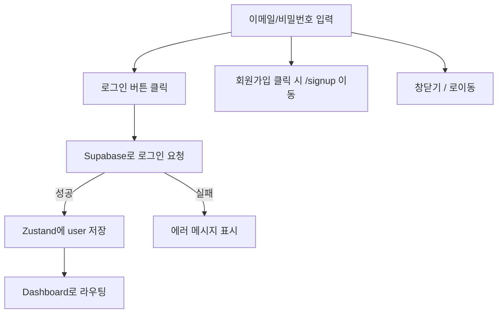

## 🧠 N.E.X.T 파인만 구조 해석

|파트 이름|코드 위치|한 문장 설명 (E)|흐름 분석 (X)|내가 쓴다면 (T)|
|---|---|---|---|---|
|`useState`|상단 Hooks|이메일, 비밀번호, 메시지, 로딩 상태 저장|사용자 입력 감지 & 메시지 처리|`react-hook-form`으로 통합 처리|
|`useRouter`|상단 Hooks|로그인 후 페이지 이동을 위한 라우터|로그인 성공 시 `push('/dashboard')`|`useRouter` 대신 `useNavigate` (`next/navigation`)로 최신화|
|`useUserStore`|Zustand store|로그인한 유저 정보를 전역 상태로 저장|로그인 성공 → `userStore`에 user 저장|`zustand + persist`로 로그인 유지|
|`supabase.auth.signInWithPassword`|`handleLogin`|Supabase 인증 API로 로그인 시도|입력값 유효성 검증 후 API 호출|`try/catch`로 에러 감싸고 명확히 로깅|
|`router.push('/dashboard')`|성공 콜백|로그인 성공 시 대시보드로 이동|사용자가 로그인 후 사용할 메인 화면 진입|리디렉션 대신 `useEffect` + 상태로 `redirect` 처리 가능|
|`회원가입 버튼`|하단|계정이 없다면 회원가입 페이지로 이동|회원가입 페이지로 `router.push()`|`/signup` URL을 직접 `Link` 컴포넌트로 처리|

---

## 🌀 전체 흐름도 (eXpand 단계)



---

## 🔎 코드별 핵심 해석 요약 (E)

```tsx
const { data, error } = await supabase.auth.signInWithPassword({ email, password });
```

- Supabase의 인증 API 호출.
- 이메일/비밀번호로 로그인 시도.

```tsx
if (error) {
  setMessage(error.message);
} else {
  setUser(data.user);
  router.push('/dashboard');
}
```

- 에러 발생 시 메시지 출력.
    
- 로그인 성공 시 상태 저장 + 대시보드 이동.
    

```tsx
onClick={() => router.push('/componects/signup')}
```

- 회원가입 버튼 클릭 시 `/componects/signup` 페이지로 이동.
    
- (타이핑 실수: `components`가 아닌 `componects`로 되어 있음)
    

---

## ✍️ 내가 쓴다면 (Tweak)

| 항목          | 지금 방식                    | 개선 포인트                                            |
| ----------- | ------------------------ | ------------------------------------------------- |
| **폼 관리**    | `useState`               | `react-hook-form + zod`로 validation 및 상태 통합       |
| **라우팅**     | `useRouter().push()`     | `next/navigation`의 `useRouter().push()`로 최신 방식 적용 |
| **에러 처리**   | 메시지만 보여줌                 | toast 방식 or UI error box로 사용자 경험 개선               |
| **회원가입 이동** | `button + router.push()` | `Link` 컴포넌트로 SEO, UX 모두 챙김                        |
| **상태 저장**   | `useUserStore.setUser()` | `zustand + persist`로 로그인 유지 상태 처리                 |

---

## ✅ 한 문장 정리

> 이 코드는 **Supabase 인증 시스템을 사용한 간단한 로그인 폼**으로,  
> **전역 상태 저장, 라우팅, 오류 표시까지 하나의 함수형 컴포넌트로 구현한 실전 예제다.**

