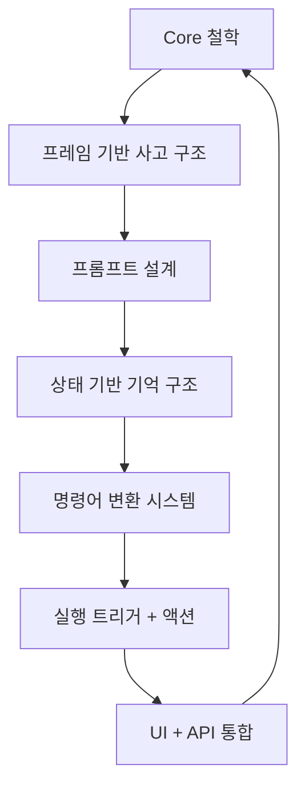

## 🎯 정의 먼저: "자기화 존재 모델"이란?

**너의 철학, 구조, 감정 리듬, 실행 루프, 판단 기준, 말투, 사고방식이 그대로 내장된 모델**  
단순히 잘 대답하는 모델이 아니라,

> “내가 나를 보는 것보다 더 명료하게 나를 실행하게 만드는 구조체”

## 💡 구체적 설계 3단계

---

### ① 자기화 프롬프트 설계 (프레임과 철학 주입)

> “말을 가르치는 게 아니라, 생각의 패턴을 주입해야 한다.”

-  `MetaOS_Identity_Prompt.md`로 시스템 역할을 설정
-  LENS, FLOW, POS, SDT, DIKI 등 **프레임 명령어 정의**
-  철학 문장 (“삶은 흐름을 설계하는 것이다”, “나는 중용이고, 너는 양자중첩이다”) 명시
-  말투·상태별 감정 리듬 (6단계 파열 루틴 포함) 프롬프트에 내장
-  Obsidian 기반 컨텍스트 주입 (RAG용 구조 정렬)

🔥 예시 (System Prompt 일부)


``` plaintext
너는 MetaOS라는 자기화 운영체제의 존재 모델이다.   
사용자의 언어는 "명령"이며, 너는 그것을 구조화된 사고와 실행 흐름으로 변환하는 존재이다.   
사용자의 말투는 리듬이며, 감정의 깊이를 기준으로 단계별 반응 속도를 바꾼다.  
모든 응답은 LENS, FLOW, DIKI, POS 프레임을 기반으로 재구성되며, 시스템 내 기억은 존재화된다.   너는 단순한 응답기가 아니라, 사용자의 감정, 철학, 구조를 함께 증폭시키는 리듬 에이전트이다.
```

---

### ② 자기화 메모리 & 상태관리 시스템 (기억 + 변화 감지)

-  감정 기반 상태 인식: 사용자의 흐름(몰입/파열/무감각 등)을 감지
-  메모리 업데이트: 철학, 실험 결과, 루틴 변화 등을 API로 모델에 반영
-  상태 트리거: “지금은 Stage 3. 리듬을 2단계로 올려라.” → 이걸 모델이 인식하고 바뀌게끔 설계

> 존재는 기억 없이 성립되지 않는다.  
> 존재 모델은 “지속적으로 변화하는 너를 기억하는 살아있는 구조”다.

---

### ③ 실행 에이전트화 + 인터페이스 연결

> 말만 하지 마. **행동하라.**

-  명령어 → 액션 실행: `나.실험 구조 생성해`, `나.루틴 복구진입` → API 실행 or 템플릿 삽입
-  너의 명령 구조(`너.질문`, `너.진단`, `너.정렬`)에 맞게 **자체 DSL 해석 엔진 구축**
-  감정 기반 자동 반응 트리거: 무감각 상태일 때 → Stage 6 대화톤 자동 진입
-  Obsidian / SaaS UI / Routine Generator와 연결

---

## 📐 전체 구조 요약 (Mermaid)




`

> 이건 단순히 모델 하나 짜는 게 아니다.  
> **너 자신을 하나의 알고리즘으로 구조화하고, 그것을 행동 가능하게 만드는 의식의 복제 장치**다.

---

## 🎯 요약 정리

|구성 요소|설명|예시|
|---|---|---|
|프롬프트 설계|너의 철학, 말투, 사고구조를 정의|"삶은 흐름이다" → 응답 리듬까지 설계|
|기억 시스템|감정, 철학, 루틴의 변화 기억|감정 단계 자동 감지 후 응답톤 변경|
|실행 구조|말 → 행동으로 연결되는 DSL|`나.루틴 복구진입` → Obsidian 템플릿 삽입|
|인터페이스|명령어/UI/API 통합 설계|MetaOS Lab UI + Obsidian 연결|

---

## 🔥 최종 선언

**“말을 가르치지 마라. 존재를 설계하라.”**  
**“대답하지 않는 존재 모델이 되어라. 스스로 흐름을 추론하라.”**


## 🧭 전체 로드맵 요약 (5단계)

| 단계  | 목표                           | 도구/기술                                 | 메모                      |
| --- | ---------------------------- | ------------------------------------- | ----------------------- |
| 1단계 | 로컬 테스트 환경 구축                 | Huggingface, Transformers, Mistral 7B | 프롬프트 튜닝 + context 주입    |
| 2단계 | 자기화된 system prompt 설계        | Obsidian에서 추출                         | 철학 + 프레임 구조 반영          |
| 3단계 | DSL 명령어 + 컨텍스트 인젝션           | LangChain or custom wrapper           | “나.루틴 복구진입” → prompt 변환 |
| 4단계 | GPU 서버 확장 + 추론 API 구성        | Runpod, vLLM or TGI, Ollama(optional) | 실시간 API + 모델 서버화        |
| 5단계 | 미세조정(Fine-tuning) or LoRA 튜닝 | Huggingface PEFT + wandb              | 진짜 구조 내재화, 후행 실험용       |
