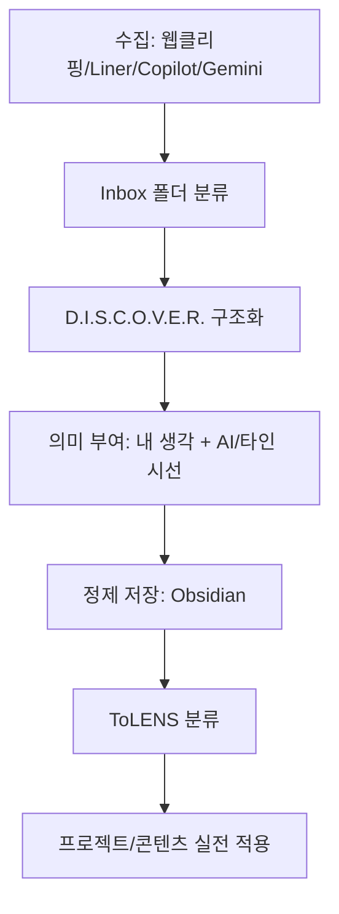

[[00_OV__HomeFrames]]
[[03_STR__PATH_Structure]]
[[03_STR__PATH_Structure]]

[[Indox-Anaslys-Overview_WorkFlow.md]]
[[Flow_manual_Obsidian.md]]
[[95_STR__AI_Tool]]

# "**어떤 도구를 어떤 흐름에서 쓸지 전문화된 룰셋설정없었다.**"

| 목적        | 도구      | 키워드 방식          | 저장 위치             | 연계 대상          |
| --------- | ------- | --------------- | ----------------- | -------------- |
| 트렌드/아이디어  | Liner   | 감성 키워드 + 블로그/뉴스 | Obsidian Inbox    | NotebookLM     |
| 기업/팩트 기반  | Copilot | 정확 키워드 + 출처 명시  | Obsidian Research | Claude         |
| 영상/PDF 포함 | Gemini  | 멀티모달 키워드        | Obsidian Summary  | Claude, Notion |
# 전략구성

"Liner로 1차 스캐닝 -> Gemini로 2차 통합 리서치 -> Copilot으로 팩트 검증"

| 단계           | 목적            | 해석 키워드 (예시) |
| ------------ | ------------- | ----------- |
| **D**efine   | 무엇을 찾고자 하는가?  | 목적 & 질문 정의  |
| **I**dentify | 어디서 찾을 것인가?   | 도구/플랫폼 선정   |
| **S**can     | 표면 스캔         | 전체 윤곽 파악    |
| **C**ollect  | 정보 수집         | 클리핑, 저장     |
| **O**rganize | 구조화           | 메모, 태그, 연결  |
| **V**alidate | 신뢰성 검토        | 출처, 일관성     |
| **E**xtract  | 핵심 정리         | 요약, 재구성     |
| **R**eframe  | 내 컨텍스트에 맞게 변환 | 질문/프레임 재입력  |

 