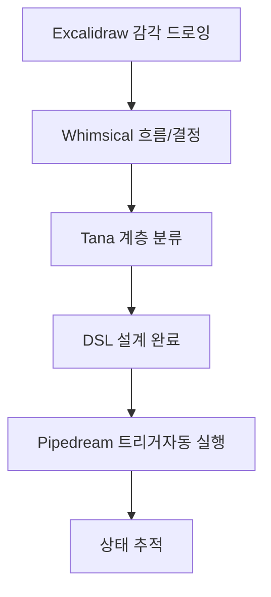

[[_Frames_Libray_Logs]]

# Internal
[[02_STR__Excalidraw_Tool]]
[[03_STR__Whimsical_Tool]]

# Information
[[04_STR__D.I.S.C.O.V.E.R_Tool]]
[[05_STR__LENS_Tool]]
[[06_STR__Tana_Tool]]

# Execution
[[95_STR__Pipedream_Tool]]

# External

# Reality
[[95_STR__Marketing_A-B_Test_Tool]]

# Production
[[00_FN__PoMoDoRo-Num_Tool]]
[[01_FN__Rize_Tool]]

## 예시 흐름

[로직 판단]
   ↓
01_Internal_design  → 구조화 도구 (Obsidian + Canvas + Mermaid)
   ↓
02_Information_Structure → 정보 정제 (NotebookLM, Dataview, Tana)
   ↓
03_Execution_priority → 실행 시스템 (실행해야할일 정렬,Make, Kanban, QuickAdd)
   ↓
04_External_connections → 도구·사람 연결 (엘리베이터 피치,Tiro, Notion, API 연동)
   ↓
05_Reality_Systems → 현실 반영 감지 (Rize, GA, Results Log, LeanCanvas, Marketing)

