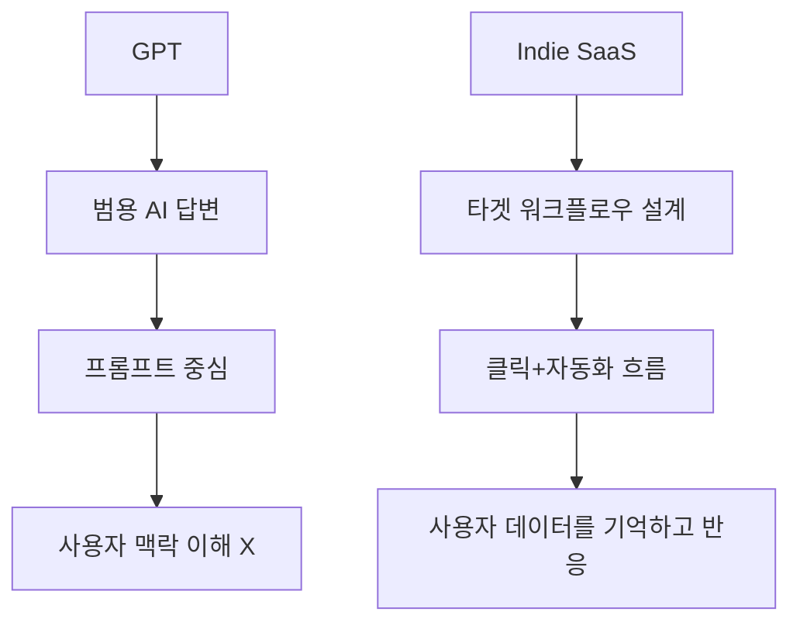

[[Home]]
## **GPTs (Generative Pre-trained Transformers)**

- **목적:** 자연어 처리(NLP) 기반 텍스트 생성 및 이해
    
- **운영 방식:** 대형 AI 모델(OpenAI의 GPT 등)이 기반
    
- **활용 범위:** 챗봇, 문서 요약, 코드 생성 등 일반적인 AI 활용
    
- **특징:** 광범위한 데이터를 학습하여 범용적인 작업 수행 가능
    
- **한계:** 특정 산업 또는 니치 시장에 대한 맞춤형 기능 부족
    

 ## **인디해커 SaaS 기반 AI 서비스**

- **목적:** 특정 업무(예: 마케팅 자동화, 콘텐츠 생성) 최적화
    
- **운영 방식:** 소규모 개발팀이 특정 기능 중심으로 구축
    
- **활용 범위:** 특정 타겟 고객을 위한 맞춤형 솔루션 제공 (릴리스AI 같은 마케팅 및 SEO 특화 서비스)
    
- **특징:** 실질적인 비즈니스 운영에 필요한 기능 위주로 개발됨
    
- **한계:** 일반적인 AI보다 데이터 기반이 작고 범용성이 떨어질 수 있음

## 결론
GPTs:범용적이지만 특정 산업 맞춤형 기능이 부족
SaaSAI서비스: 전문적인 분야의 AI활용에 강점

즉, GPTs는 AI엔진 자체이고, AI SaaS는 이 엔진을 활용해 특정 문제를 해결하는 맞춤형 플랫폼이라고 보면된다.

## MetaOS랑은 무슨차이?
쉽게 말하면
GPTs는 "말해봐"
AI SaaS는 "버튼눌러봐"
-> MetaOS는 "너 지금 이 상태니까, 이 흐름으로 가자"라고 말하는 시스템

사용자 언어 기반 DSL로 명령어 기반 내장 인터페이스있음
일반 SaaS: 기능 중심 (ex요약, 자동화)라면
MetaOS: 사고 + 감정 + 실행 흐름 통합
-> DIKI,Flow,POS,SDT,LENS 같은 프레임이 내장됨

| 도구      | 비유                             |
| ------- | ------------------------------ |
| GPTs    | 만능 공구 세트                       |
| AI SaaS | 전동드릴, 전기톱 등 기능별 공구             |
| MetaOS  | **건축가의 사고방식 + 툴킷 + 건물 설계도 자체** |
>GPT는 벽을 뚫어주고,  
>SaaS는 버튼 하나로 뚫지만,  
>**MetaOS는 "어느 벽을 왜 뚫을지, 뚫은 다음 어떻게 설계할지"까지 기억하고 조정해줌.**

>**MetaOS는 "사고의 SaaS"이고, GPTs는 "지능의 API", 일반 SaaS는 "도구의 앱"** 
>**지능-도구-사용자 사이에 있는 ‘실행 뇌’를 담당하게됨**