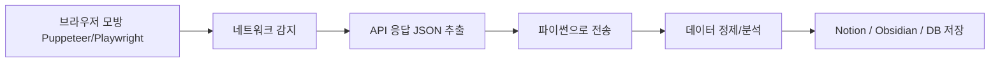

## 파이썬 vs 자바스크립트(=공장이고 vs 포털이다)
역할을 나누면된다.

- 크롤링툴 (JS계열): `Playwright` - 자동 클릭, 대기, JS 렌더링 기다려줌
- 데이터 포맷: `JSON` - 중심으로 추출
- 처리툴 (Python): `Pandas , Re , Sqlite3 , Py-notion , markdownify`
- 노드 or 파이썬 통신: `REST API` or `Local temp file` 넘기기
- 자동화 트리거: `Make` or 내부 스케쥴러

### 크롤링 흐름(현업 기준)

### 왜 이런 흐름이냐
- **Next.js, Nuxt 등 SSR/CSR 혼합 프레임워크가 대세**  
    → 페이지는 정적인 척하지만, 핵심 데이터는 API 콜로 나감  
    → HTML에 없고 JS로 렌더링 
    
- **HTML 기반 크롤러 (requests, BeautifulSoup 등) 무력화됨** 
    → JS 동작 없으면 데이터 못 가져오며 제약이 많아짐
    → 이제 크롤링 자체도 '프론트 해킹'처럼 해야 한다는 생각
    
- **Puppeteer, Playwright가 해결사처럼 등장**  
    → JS로 브라우저 조작하고, 네트워크 탭에서 API 콜까지 추출 가능.  
    → 여기서 JSON만 뽑으면? 파이썬으로 넘겨서 리파이닝/분석 가능.
    
- **파이썬은 분석/자동화에 여전히 독보적임**  
    → `pandas`, `sqlite3`, `Notion API`, `Obsidian MD 변환`  
    → 분석/정제/자동화 루프에선 자바스크립트는 절대 못 이김.

## JSON
| 포맷           | 단점 요약                          |
| ------------ | ------------------------------ |
| **XML**      | 가독성 구림, 파싱 복잡, 무겁다             |
| **CSV**      | 구조가 약함, 중첩 표현 못 함              |
| **YAML**     | 깔끔하지만 들여쓰기 민감 + 오류 많음          |
| **Protobuf** | 빠르고 효율적이지만 **이진 데이터**라 디버깅 어려움 |
- 이진 데이터 전송엔 protobuf이 휠씬 빠름
- 대용량 통신 최적화시 JSON은 느리다.
- 구조적 제약이 약하다. 스키마 없이 쓰면 지옥이다.

### 대안
> GraphQL + JSON / OpenAPI + JSON schema 같은 확장형 구조

### GraphQL
> 필요한 데이터만 골라서 가져오는, 질의(쿼리)기반 API 방식

| 항목    | REST API                          | GraphQL                                   |
| ----- | --------------------------------- | ----------------------------------------- |
| 방식    | 정해진 URI를 호출해서 전부 받아옴              | 하나의 엔드포인트에서 원하는 필드만 골라 요청                 |
| 예시    | `/user/1` 요청 → 이름, 나이, 주소 모두 리턴됨  | `query { user(id:1) { name } }` → 이름만 리턴됨 |
| 문제점   | **Overfetching/Underfetching** 생김 | 원하는 것만 받아서 트래픽 최적화 가능                     |
| 문서화   | Swagger/OpenAPI 따로 필요함            | 스키마 자체가 문서 역할도 함                          |
| 연동 방식 | RESTful하게 여러 API 나눠 호출            | 한 쿼리로 여러 리소스를 조합해서 받음                     |
> REST는 편의점 "도시락" / GraphQL은 뷔폐에서 원하는 재료만 골라오는 "접시"

